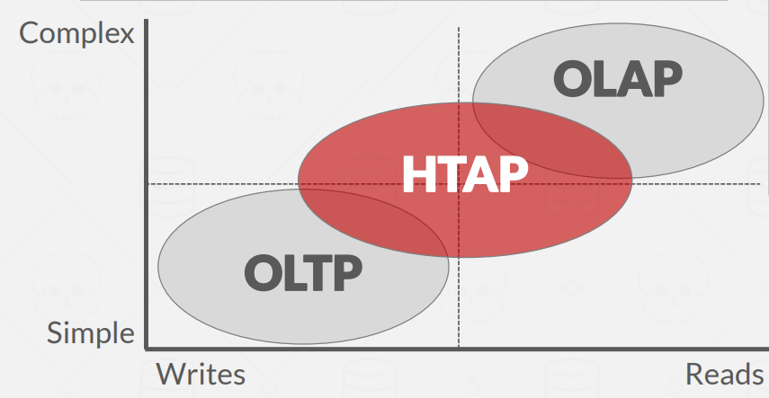
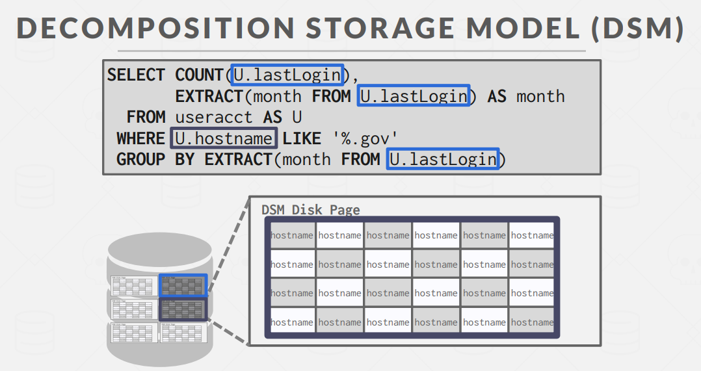
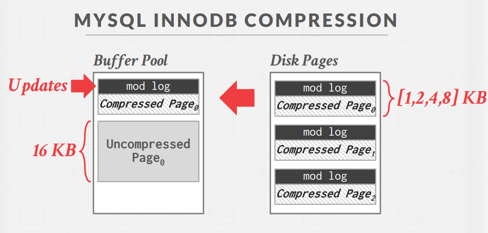
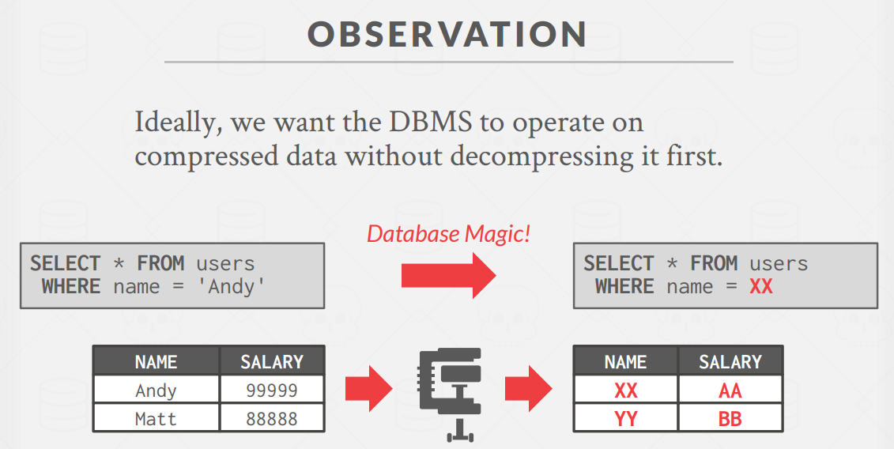
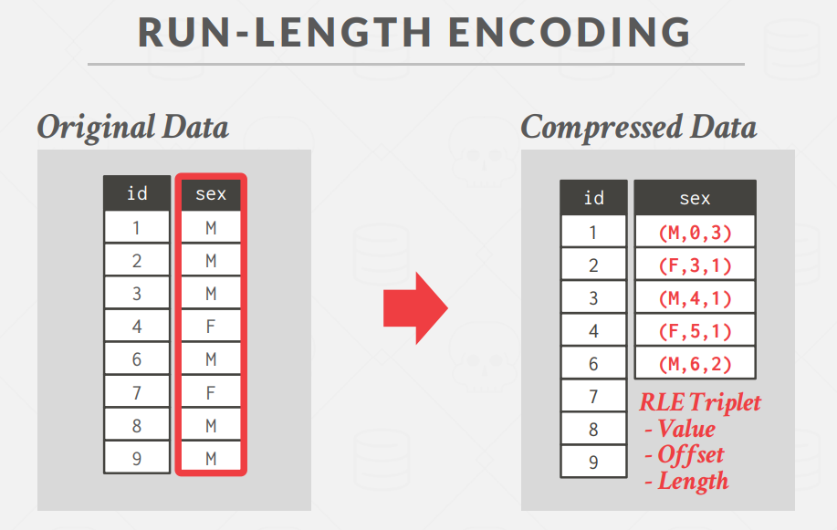
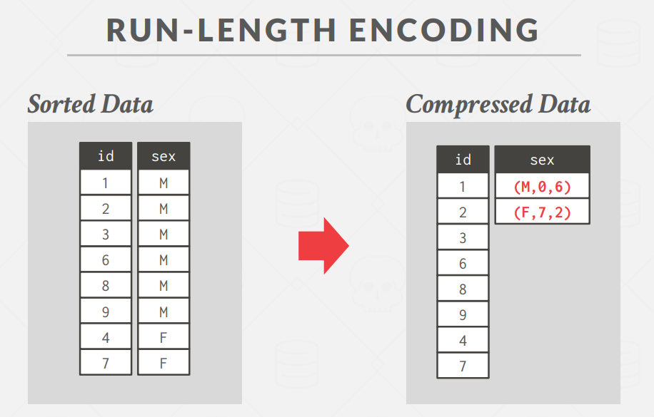
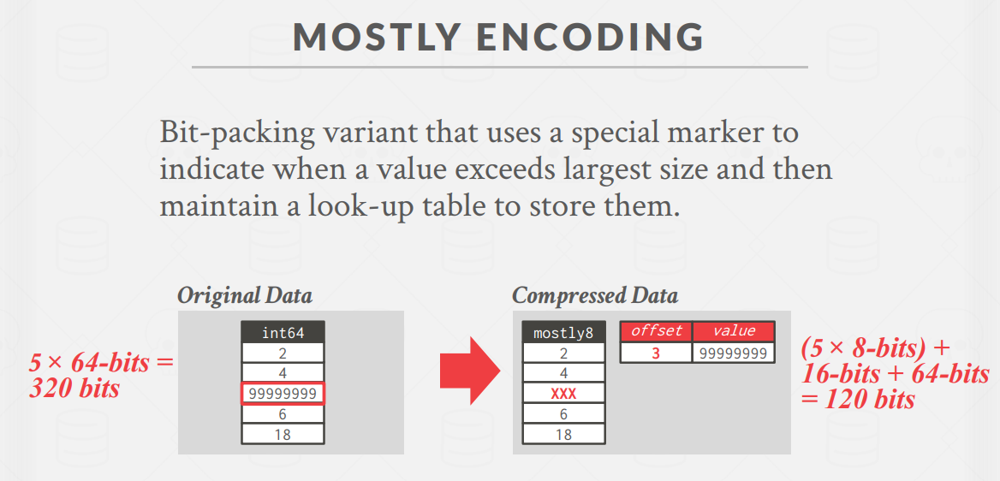
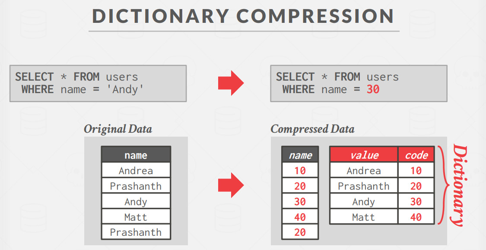
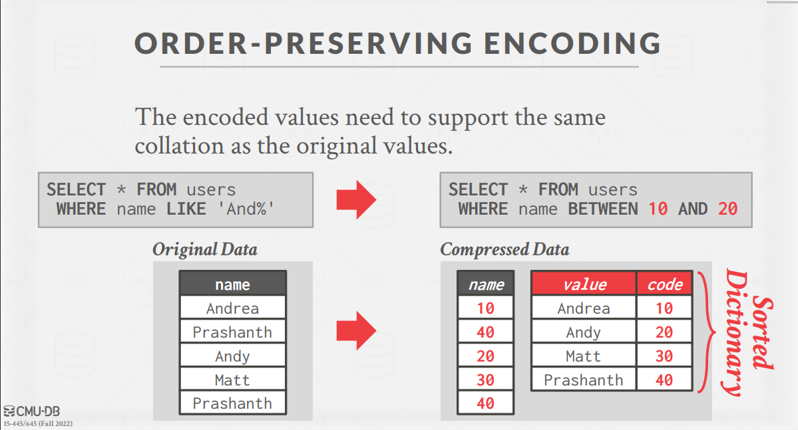

# B+ Tree Index

- [B+ Tree Index](#b-tree-index)
  - [Storage Models \& Compression](#storage-models--compression)
    - [Database Workload](#database-workload)
    - [Database Storage Models](#database-storage-models)
    - [Compression](#compression)
      - [Run-Length Compression](#run-length-compression)
      - [Bit-Packing Compression](#bit-packing-compression)
      - [Mostly Compression](#mostly-compression)
      - [Bitmap Compression](#bitmap-compression)
      - [Delta Compression](#delta-compression)
      - [Incremental Compression](#incremental-compression)
      - [Dirtionary Compression](#dirtionary-compression)

## Storage Models & Compression

### Database Workload

* On-line Transaction Processing: Simple queries that only read/modify a small part of database, sometimes alse needing to read a entire tuple from database
* On-line Analytical Processing: Complex queries that read/modify a large portion of the database, usually needing to scan multiple tuple
* Hybird Transaction + Analytical Processing: The combination of OLTP and OLAP

### Database Storage Models

DBMS store tuple in different ways that is batter for eithor OLTP or OLAP. The basic storage models are as follow:

* row storage(n-ary storage model, NSM): Simply store tuple with the entire attribute one after the other, which is ideal for OLTP
* colume storage(decomposition storage model, DSM): DBMS contiguously store a single attribute(column) for all tuple, which is ideal for OLAP

Since OLTP tends to read entry tuple and do a lot of inserts, NSM is ideal. On the other hand, let's say we want to extract some attribute from multiple tuple to analysis, NSM would cause expensive overhead

So in this scenario, DBMS must use DSM to store tuple

Therefore, we can extract some useful attribute of the tuple instead read all attribute of the tuple

### Compression

As an example of musql innoDB compression, which shown in the following figure

Mysql default page size is 16KB, so we compress it and round to the power of 2. In the front of the compressed page , called mod log,  is used to store update log. Let's say we want to update some tuple in compressed page, instead of decompressing it, we can add update log into mod log. When we want to evict certain compressed page, we would evict this page as well as mod log.

Let's say we want to read certain tuple without decompressing it first, this is ideal

As the shown of the firgre, when we want to specify where clause, in this example, is 'andy', if we can replace 'andy' to another something, in this scenario, we can select in compressed data without decompress it

The rest of this chapter, we would introduce some compression algorithm

#### Run-Length Compression

We can compress data as a sequence of triplets, all of which contain the value of this triplet, the offset of this triplet and the number of value which triplet represents

Further, if we can sort the original data before compression, we can get higher compression ratio

#### Bit-Packing Compression

Bit-Packing is very intuitive, we can store the useful data instead of storing entire data

#### Mostly Compression

This is varient of the bit-packing compression. In original data, if exist a specail data, which is large than any other, we can replace this value with a specail marker. If we scan for this marker, we would find this value in another table

#### Bitmap Compression

We can store a separate bitmap for special attribute, where its offset is corresponding to the tuple

It looks like this compression has high comression retio, but, to make matter worse, let's say we have 1e5 tuple, and we use this encoding for `int32`, the comparition as following:

* Decompression: $32\ bits\times 10^5$
* Compression: $INT32_{MAX}\ bits\times 10^5$

#### Delta Compression

For time data or another with same attribute, for each value, we can store its difference with the first value, as the following figure show:

#### Incremental Compression

In common prefix table, the first entry is null, for every another enrties, we consider what frefix portion of the front string I have. As an example, `robbed` has the prefix `rob` in the front string `rob`, `robbing` has the frefix `robb` in the front string `robbed`, the rest of string follow this patten

#### Dirtionary Compression

This compression method is suitable for our ideal compression, we can read compressed data without compress it. As an example of the follow figure show, we replace 'andy' with integer number `30`

This compression is also supprot range query, as the shown of following figure:

