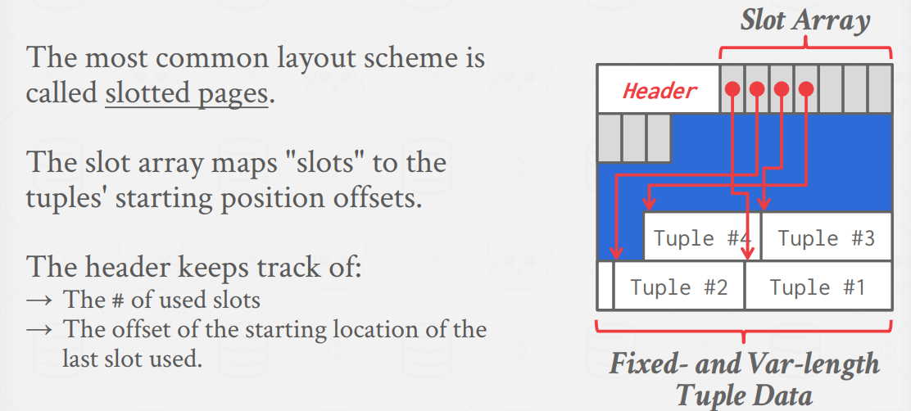
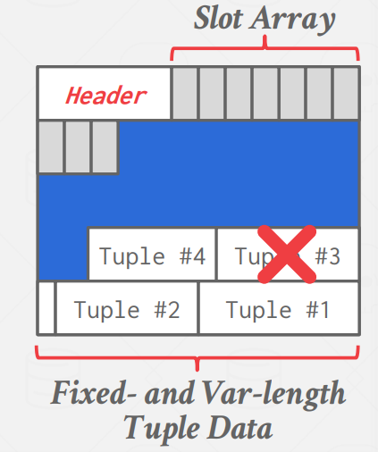
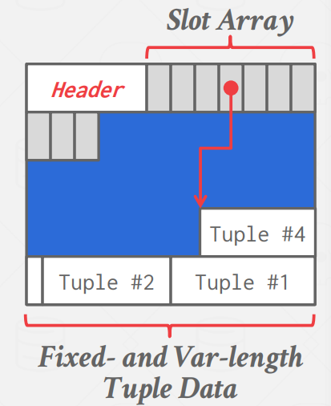
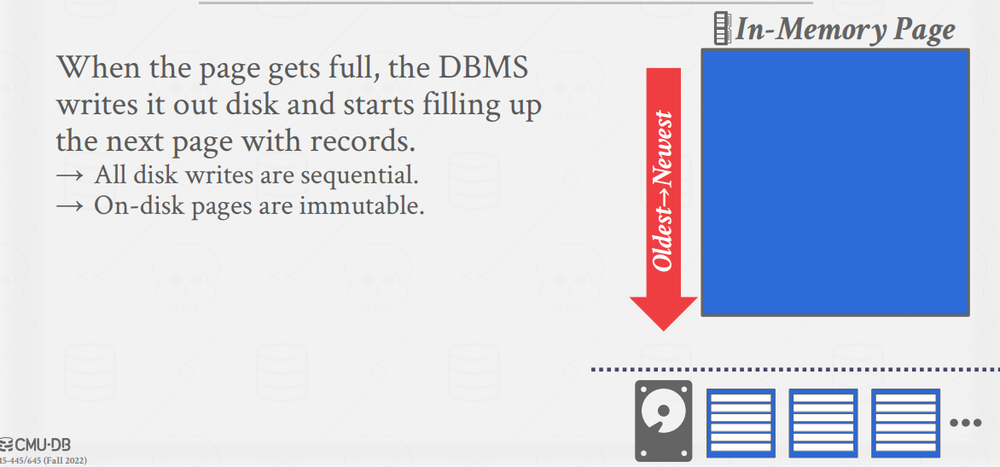
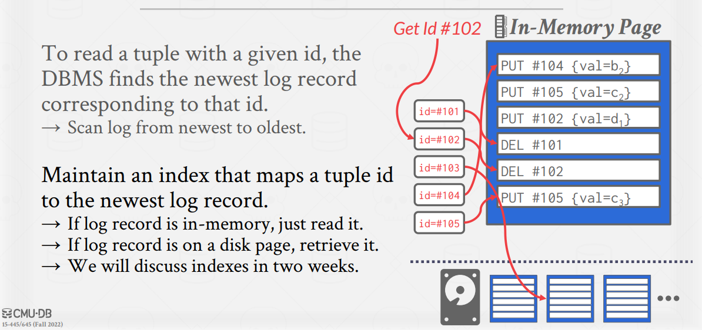
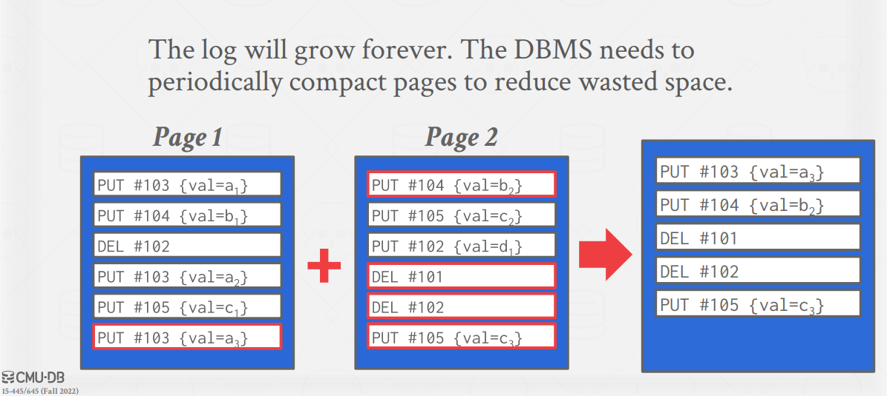
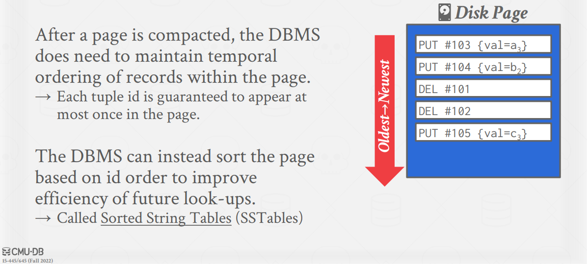

# Buffer Pool Manager

- [Buffer Pool Manager](#buffer-pool-manager)
  - [Relational Model](#relational-model)
    - [Database \& DBMS \& Data model](#database--dbms--data-model)
    - [Relational Model](#relational-model-1)
  - [SQL](#sql)
    - [Relation \& tuple](#relation--tuple)
    - [Schema \& Instance \& Domain](#schema--instance--domain)
    - [Superkey \& Candicate Key](#superkey--candicate-key)
    - [Referential integrity constrain \& foreign-key constrain](#referential-integrity-constrain--foreign-key-constrain)
    - [Session](#session)
    - [natural join \& outer join](#natural-join--outer-join)
    - [Common Table Expression(CTE)](#common-table-expressioncte)
    - [Recursive CTE](#recursive-cte)
  - [Database Storage](#database-storage)
    - [File Storage](#file-storage)
      - [Heap File Organization](#heap-file-organization)
    - [Page Layout](#page-layout)
      - [Slotted-Page](#slotted-page)
      - [Log-Structured storage](#log-structured-storage)
    - [Tuple Layout](#tuple-layout)

## Relational Model 

### Database & DBMS & Data model

*Database* is a organized collection of inter-related data that modles the aspect of the real world, and the *database management system*(DBMS) is a software to management database. Therefore, database is a set of data, and DBMS can be thought of a interface to control the database.

Database is stored as comma-seperqted value(CSV) file that DBMS manages, every entity well be stored in its own file, and application has to prase the CSV file to read or write recoed. Each entity has its own set of attributes, so **defferent record** are delimited by new line, while each of corresponding attributes **within a record** are delimited by comma

From this perspective, database can be thought of as a collection of multiple files

Consider a database models a digital music store, the two basic entities aes artist and album, so we need two CSV file to store every record in entities

*Data model* is a collection of concept for describing the data in database. *Relational model* is one of the *data model*

### Relational Model

Early database application were diffcult to build and maintain because there was a tight copluing between logical layers and physical layers, therefore the *relational model* was gradually proposed.

*Relational model* define database abstraction **based on relations** to avoid maintainance overhead.

It has three key points: 

* Store database in simple structure(relations)
* Access data through high-level language, DBMS just figure out best execution strategy
* Physical store(how to store data in physical layers) left up to DBMS implementation

Relation data model defines three concepts:

* Structure: The definition of *relations* and their content., what attributes *relations* contain and what value attributes can hold
* Integrity: Ensure the database's contents satisfy constrains(for example the value of attribute has to number or string)
* Manipulation: How to access and modify the database's content

## SQL

### Relation & tuple

*Relation* is an unordered set that contain the relationship of attributes that represent *entities*. Therefore, *relation* simplely a unordered set, and it contain a series of attrbutes, all of which have corresponding value.

*Tuple* is a set of attributes values in *relation*, value can be atomic(i.e. number, string, bool), scalar, lists and other nested data structure.

A *relations* has two *key*, which is *primary key* which **uniquely** identifies a single *tuple* and *foreign key* which specifies an attribute from one *relation* has map to a *tuple* in another *relation*

* *Relation* has a lot of pairs which contain *key* and *tuple*
* *tuple* simplely a set of value, each of which corresponding to single attribute

### Schema & Instance & Domain

*Schema* is a description of a particular collection of data based on *data model*.

*Instance* is a state which database stores the informance at a particular moment

If we abstract *relation* into a table, the *attribute* is the meaning of column, and the *tuple* is the value of attribute/element in the row

That's to say, in the *relational model*, data are represented in the form of table(*relation* also refers ot table). Each table have multi column, each column has a unique name(*attribute* refers to the name of colume). Each row of the table represents the value of each attribute(*tuple* refers to row). The permitted value of the attribute in table is *domain*(the *domain* of all attribute is **atomic**, namely, its element are considered to be indivisible units)

Schema and instance can be understood by analogy to programming language. The *database scaema* is corresponding to the variable declarations, and the value of the variable at a point in time corresponding to the *database instance*

### Superkey & Candicate Key

We require that no two tuple in relation have exactly the same value for each attribute, Therefore we need a way to distinguish two tuple. We use the concept of *superkey* to solve it, *superkey* is a set of **one or more attribute** that can specify uniquely a tuple in relation

Formally, Let $R$ denote the set of attributes in relation $r$, if we say subset $K$ of set $R$ is a *superkey*, that is, $t_1$ and $t_2$ are both in $R$ and $t_1 \neq t_2$, then $t_1.K \neq t_2.K$

A superkey can contain extraneous attribute, so if a set is a superkey, then so is any **superset** for it

Formally, Let $R$ denote the set of attributes in relation $r$, if we say subset $K$ of set $R$ is a *superkey*, then any **superset** of set $K$ also is superkey

If a superkey has no porper subset, such minimal superkey are called *candidate key*

We shall use the term *primary key* to denote *candidate key*, and to be clear, the meaning of these two concept are exactly the same

### Referential integrity constrain & foreign-key constrain

> Page: 46

The *foreign-key constrain* requires that attribute(s) of referencing relation must be the **primary key** of the referenced relation. the *referential integrity constrain*, on the other hand, simply requires that the value appearing in referencing relation **must** appears in referenced relation

### Session

The session, in database, refers to a connection established between a user and a database system for a special period of time. During the session, database system would keep track of session-special informance(e.g. identity, privilege), user can also perform multi operation. The session remains active until user log out, disconnect, or set timeout period is reached. 

### natural join & outer join

Suppose we have two relation called $A$ and $B$ respectively, and only attribute they shared. *Natural join* operation will list the collection of tuple that have the same value of this attribute in both realtions. The tuple which don't appear in the result relation have two main reason, one is corresponding attribute value are not same; the other is this tuple of this attribute in first relation don't appear in the second relation

Therefore, *outer join* is a workaround, which will list those tuple don't appear in second relation

### Common Table Expression(CTE)

The common table expression(CTE) allows you to create a *temporar*y* named result set that aviable temporarily to `SELECT`, `UPDATE`, `DELETE` clause

### Recursive CTE

A recursive common table expression (CTE) is a CTE that references itself. By doing so, the CTE repeatedly executes, returns subsets of data, until it returns the complete result set.

The execution order of a recursive CTE is as follows:

* First, execute the anchor member to form the base result set (R0), **use this result for the next iteration**.
* Second, execute the recursive member **with the input result set from the previous iteration** (Ri-1) and return a sub-result set (Ri) until the termination condition is met.
* Third, combine all result sets R0, R1, … Rn using UNION ALL operator to produce the final result set.

## Database Storage

### File Storage

DBMS store database as one or more **file** in disk, and this file is seprated by several partition called *block(page)*. Different DBMS manage page in file in different way: 

* Heap File Organization
* Tree File Organization

Hardware page usually *4K*, OS page usually *4K*, and database page vary from *1K* to *16K*. The read and write operation in Hardware page is *atomic*

#### Heap File Organization

The *heap file* is an unordered collection of pages with tuple that store in random order. Therefore, in single file, we can easily find a specific page by adding the *begin address* and *offset*. On the other hand, in multiple file, we need meta-data to track which page store in which file and which file has free space

DBMS also maintain some special page called *directory*, which store the location of the page in which we store data **in database file**. Intuitively, the role of directory is similar to index

We must make sure that the content of directory is in sync with data page, both of which are simultaneously update

### Page Layout

Every page include header which contain *metadata*:

* Page size
* CheckSum
* Self-containment(This page contain all informance regarding to read and write this page)

In a database file, every page(block) are organized into certain structure, There are two commonly used ones: Slotted page and log structured

#### Slotted-Page

The header contain the number of slot and slot array

* When insertint a tuple, the slot array grows from the front to the back and the data grow from the back to the front
* When deleteint a tuple, the tuples before deleted tuple will be moved backword 

With this structure, we can easily **store variable-length tuple**

The change process is shown the following figure below

If we add a new tuple into this page, the length of *slotted array* would grow from the front to the back, the length of data tuple would grow in the opposite direction

When we delete tuple 3, as the following figure shown, we should move the tuple at the right position of the deleted tuple to left 

#### Log-Structured storage 

Instead of storing the content of tuple in file, *log-structured storage* simply sotre the change informantion in file

When the page get full, we should immediately write out to disk

If we intend to read specific tuple, with a given *tuple id*, DBMS would fild the newest log record corresponding to that id. Also, we can maintain several index which map *tuple id* to newest record

Due to the log would gorw forever, DBMS needs to compact this log periodically

After that, DBMS needs to sort this log in page, which would mitigate retireve pressure

The downside of this approach are twofold. First, it would result in *Write-Amplification*, suppoes that I insert a tuple and never update it again, when we perform compaction, this tuple would **REPEATEDLY** read into memory and written to disk. Second, the cost of compaction is much too expensive

### Tuple Layout

Every tuple contain a header, which include the metadata of this tuple

The *bitmap* stored in header used to represent whether certain attribute is *NULL*

The tuple data typically store in the order specified when create this relation 

Each tuple have a *unique identifier*(i.e. *page, slot id/offset*) 

