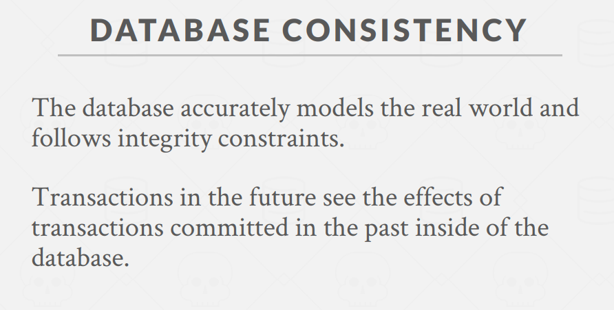
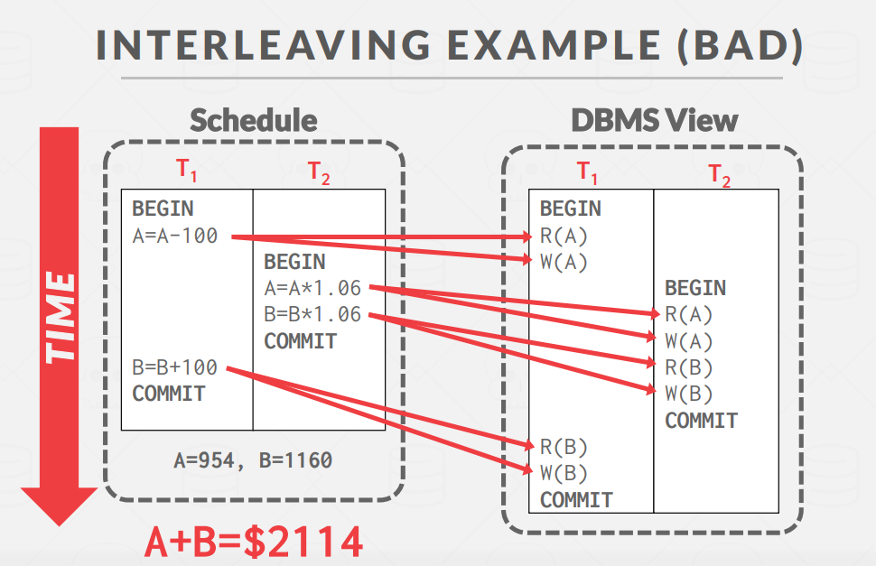
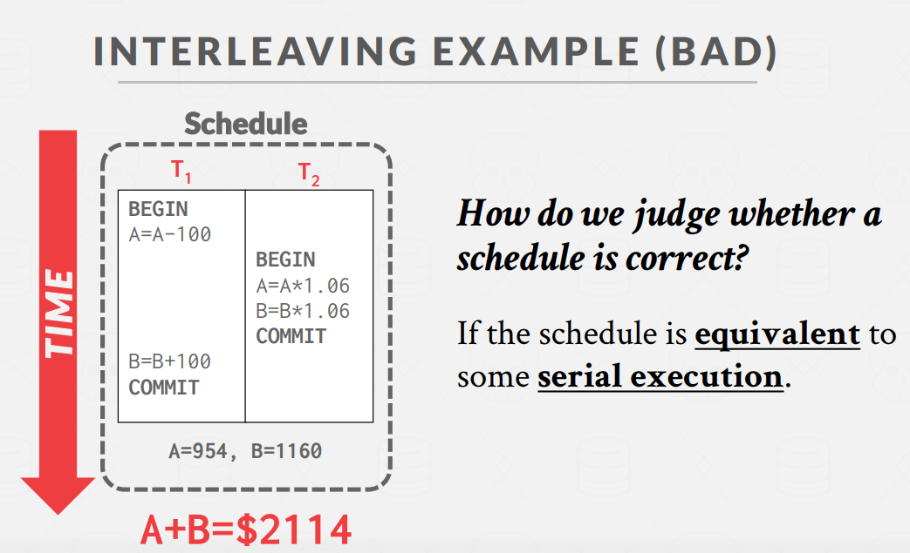
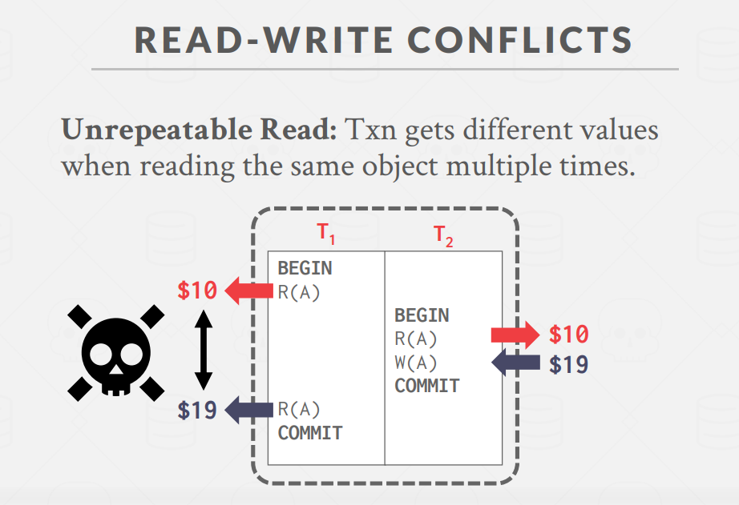
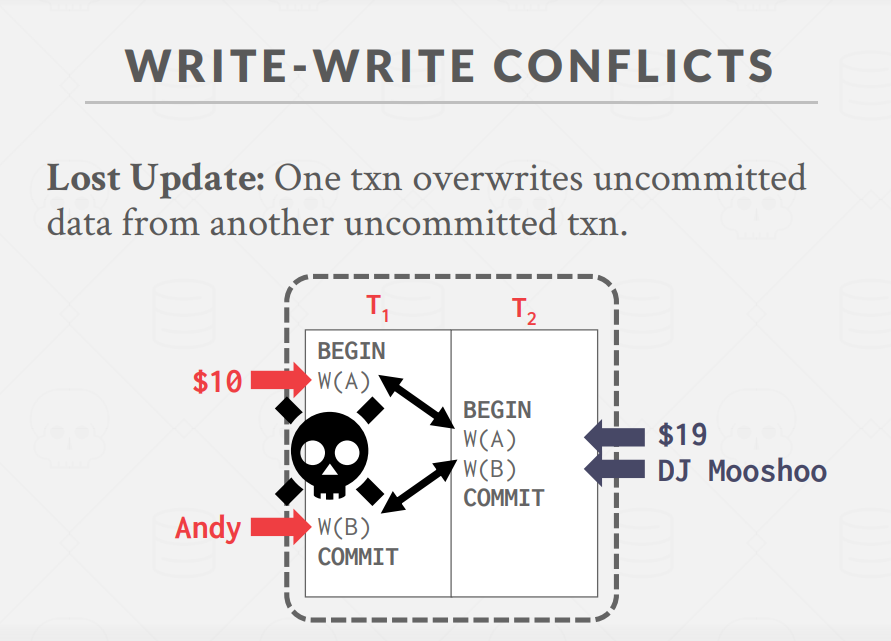
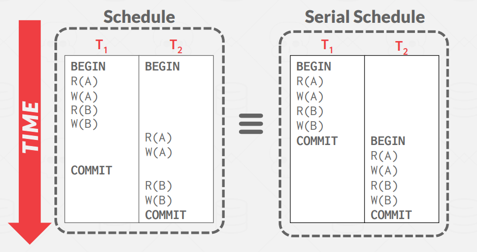
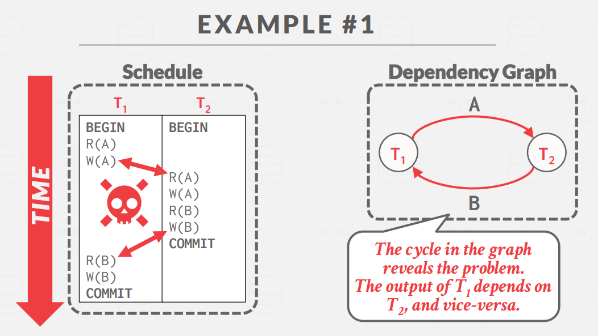
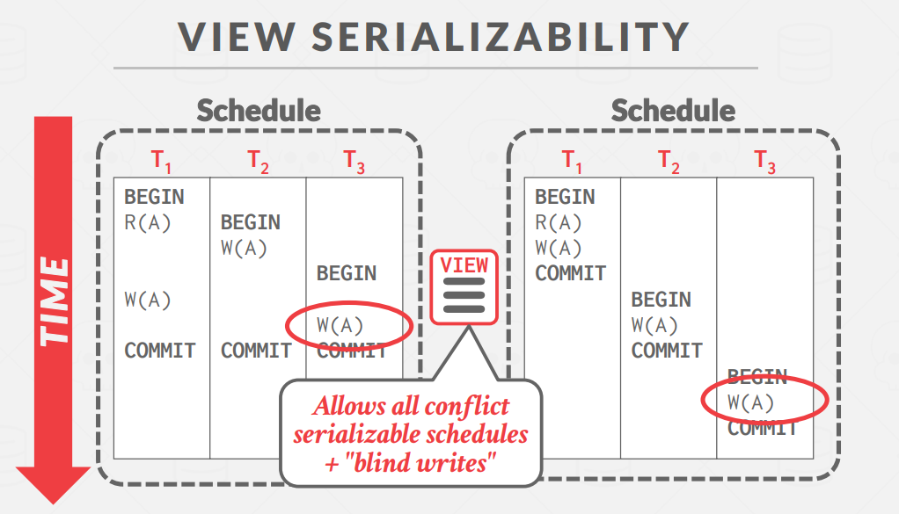
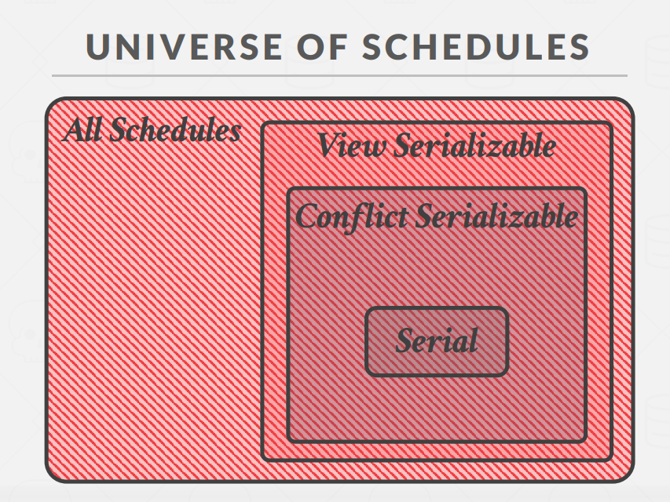

# Concurrency

- [Concurrency](#concurrency)
  - [Concurrency Control Thery](#concurrency-control-thery)
    - [Architecture](#architecture)
    - [Transaction](#transaction)
    - [Transaction Execution](#transaction-execution)
      - [Strawman](#strawman)
    - [Definition](#definition)
    - [Atomictiy](#atomictiy)
    - [Consistency](#consistency)
    - [Isolation](#isolation)
      - [Concepts](#concepts)
      - [Example](#example)
      - [Schedule](#schedule)
      - [Conflict](#conflict)
        - [Read-Write Conflicts](#read-write-conflicts)
        - [Write-Read Conflicts](#write-read-conflicts)
        - [Write-Write Conflicts](#write-write-conflicts)
      - [Serializability](#serializability)
        - [Conflict Serializablity](#conflict-serializablity)
          - [Example](#example-1)
        - [Dependency Graph](#dependency-graph)
      - [View Serializability](#view-serializability)
      - [Universe on Schedule](#universe-on-schedule)
    - [Durability](#durability)
    - [Conclusion](#conclusion)

## Concurrency Control Thery

### Architecture 

`Database` 的组件从上至下依次为：

* `Query Planning`：解析 `SQL` 生成 `AST` 并对其进行 `optimize` 得到过程
* `Operator Execution`：实际执行 `physical plan`
* `Access Method`：定义底层数据的访问，通过 `B+Tree`、`Hash Table` 等
* `Buffer Pool Manager`：绕过 `OS` 对文件系统的管理，通过自定义的组件来实现文件的读写
* `Disk Manager`：与磁盘进行交互

并发控制 `concurrency control` 和恢复 `recorver` 分别跨越 `Operator Execution, Access Method` 和 `Buffer Pool Manager, Disk Manager`，如下图所示：

`Concurrency control` 用于解决数据竞争 `data race` 的相关问题；`Recovery` 用于保证数据库系统的一致性 `data consistence`

### Transaction

事务 `Transaction` 是一系列操作的执行。例如，我们将多条 `SQL` 语句的执行看成一个整体，这个整体便是事务。`transaction` 是 `DBMS` 改变的基本单元，即只有一个完整的 `transaction` 对 `DBMS` 做出的修改才是有意义的，而不完整的事务 `partical transcation` 是不允许出现的

> A **transaction** is the execution of a sequence of one or more operations (e.g., SQL queries) on a database to perform some higher-level function. 
> 
> It is the basic unit of change in a DBMS:
> 
> → Partial transactions are not allowed!

因此，对于 `transcation` 中的操作而言，要么**全部被执行**，要么**一条都没有被执行**

举个具体的例子，假如 $A$ 要向 $B$ 转账 $100$ 元，那么事务为：

* 检查 $A$ 是否有 $100$ 元
* 将 $A$ 账户减去 $100$ 元
* 将 $B$ 账户增加 $100$ 元

### Transaction Execution

#### Strawman

关于事务如何执行，最简单的办法就是一次使用一个 `worker(or thread)` 来执行一个是事务。为了执行该事务，`DBMS` 会将整个 `database` 文件复制一份，然后对新复制的文件做修改。如果事务成功执行，那么新的文件将覆盖原先的文件；如果事务执行失败，那么新的文件将被丢弃

这种方式非常的慢，因为它不仅无法做到事务的并发执行，还需要对每个事务都复制一遍整个数据库文件

我们希望对于独立的事务而言，它们可以并发地执行，因为这可以：

* 增大系统的利用率 `utilization` 和吞吐量 `throughput`
* 减小系统对用户的响应时间 `response time`

如果我们随意交叠 `arbitrary interleaving` 不同的操作的执行，那么会导致很多的问题，在开始分析哪些 `interleaving` 是有效的之前，我们需要一个形式上的定义

### Definition

一个 `transaction, txn` 可能会对数据库中的数据进行许多的操作，**`DBMS` 只关心那些对 `database` 进行读 `read` 和写 `write` 的操作**。因此，对于数据库 `database` ，我们给出以下形式化的定义：

我们用 $A,B,C$ 来表示 `database` 中的数据对象 `data object`，用 $R(X),W(X)$ 来表示对对象 $X$ 进行读取和写入操作

在 `SQL` 中，`txn` 开始于 `begin` 字段，结束于 `commit` 或 `abort` 字段

`transaction` 正确性的评价标准为 `ACID`，具体为：

### Atomictiy

`Atomicity` 是指，`txn` 的所有操作要么被**全部执行**（对应 `commit`），要么**全部没有执行**（对应 `abort`）。一个 `txn` 被 `abort` 的对象，既可以是用户，也可以是系统。

实现 `Atomicity` 的方法有两种：

* `Logging`：`DBMS` 在事务执行的过程中，每一步都会记录「如果要撤销这一步该怎么办」。这样的话如果事务被 `abort`，`DBMS` 也可以做到对已执行的操作进行撤销 `undo`。这种日志被称为回滚日志 `undo-log`，**在内存和硬盘中同时存在**

实际上，在我们对 `tuple` 的存储结构中，除了使用 `slotted plag` 以外，还可以使用 `log structured`。也就是我们每次对 `tuple` 的更新都只将操作类型和具体的更新数据写入内存，并不会实际去更新对应的 `tuple`。这样当我们需要撤销某个操作时，直接将先去的 `log` 给删去即可

* `Shawod Paging`：对于那些 `txn` 要修改的 `page`，我们专门复制一份让其修改，等到 `txn` 提交后再将这些 `page` 替换回去

这种思想本质上和 `strawman` 的一样，由于开销过大，因此很少系统会支持这种方法

### Consistency

由 `database` 所表示的「世界」在逻辑上 `logical` 是正确的，因此所有关于数据的询问所得到的结果也应该在逻辑上是正确的

`Consistency` 分为两部分：

* `Database Consistency`

数据库表示现实世界中的实体必须要遵循其本身的约束。例如，如果表示年龄的话那么就不能为负数。此外，在未来的事务应该能看到过去**已执行**的事务的结果

* `Transaction Consistency`

如果数据库在 `txn` 开始前是一致的 `consistent`，那么在事务结束后也应当是一致的

### Isolation

#### Concepts

`DBMS` 会提供一种假象 `illusion`，使得每个事务都认为整个系统中只有它本身在运行。因此，每个事务只需要考虑数据库在事务开始时候的状态，而不需要考虑其他事务的执行是否会妨碍当前事务的执行

这种操作类似于操作系统的虚拟化，`OS` 本身没有那么大的内存空间，但它可以通过许多虚拟化的技术，让每个进程都认为自己能够使用 `64` 位的内存空间

`DBMS` 通过运行不同事物中的操作交错 `interleaving` 执行来实现 `concurrency`。具体的 `concurrency protocol` 有两种实现方式：

* `Pessimistic`：悲观地认为问题发生的概率大，做出额外的操作让问题不发生
* `Optimistic`：乐观地认为问题发生是少数的，当问题发生时再解决

#### Example

我们考虑下面这个例子：

`txn` 执行的顺序有非常多，但如果想要最终的结果满足 `consistency`，就必须要保证这次执行的净效应 `net effect` 等价于两个 `txn` 顺序 `serially` 执行的 `net effect`

以下的两个执行都能产生相同的 `logical outcome`，因此它们是等价的

两个 `txn` 的调度图如下

换句话说，两个 `txn` 的**顺序**执行是不会出现问题的

但为了提高磁盘的 `I/O` 以及提高 `CPU` 的利用率，我们需要让两个 `txn` 的执行产生 `interleaving`。这么做的好处是当一个 `txn` 需要等待某种资源时，系统内的其他 `txn` 可以继续执行

这种情况下，由于其最终结果等价于顺序执行的结果，因此 `interleaving` 不会产生问题

这种情况下，违背了 `consistency`，因此这应当被 `undo`

如果我们站在 `DBMS` 的视角来看待这个 `schedule`，会发现第二个 `txn` 对第一个 `txn` 的中间结果进行了读取，因此这便造成了最终结果的错误。因为如果两个 `txn` 是顺序执行的话，那么后执行的 `txn` 必然不可能会读取到前一个 `txn` 的中间结果，而我们想要的效果就是两个 `txn` 交叠后所产生的结果等价于两个 `txn` 顺序执行所产生的结果

#### Schedule

那么，现在我们的问题是，我们该如何判断一个调度 `shcedule` 算法的正确性

`DBMS` 执行操作的顺序被称为执行调度 `execution schedule`，我们的目标是生成与顺序执行 `serial execution` 等价的 `execution schedule`

在此之前，我们需要引入三个概念：

* `Serial Schedule` 序列化调度：调度 `shcedule` 是以序列化的形式执行的，不会 `interleaving` 两个不同 `txn` 的执行
* `Equivalent Schedule` 等价调度：如果第一个 `shcedule` 所产生的结果与第二个 `shcedule` 所产生的结果相同，这两个 `schedule` 是等价的 `equivalent`
* `Serializable Schedule` 可序列化调度：如果一个 `schedule` 与一个 `serial shcedule` 相等价 `equivalent`，那么该 `schedule` 为可序列化调度 `serializable schedule`

原文如下：

> • **Serial Schedule**: Schedule that does not interleave the actions of different transactions.
> 
> • **Equivalent Schedules**: For any database state, if the effect of execution the first schedule is identical to the effect of executing the second schedule, the two schedules are equivalent.
>
> • **Serializable Schedule**: A serializable schedule is a schedule that is equivalent to any serial execution of the transactions. Different serial executions can produce different results, but all are considered “correct”.

有了 `serializable schedule` 的概念后，我们可以很容易的判断一个 `schedule` 所产生的结果是否有效，只需要简单的判断其等价 `schedule` 是否是 `serial schedule` 即可

#### Conflict

那么现在的问题是，我们该如何判断两个 `schedule` 为等价的。为了实现这个目的，我们需要引入冲突 `conflict` 的概念

如果两个操作是 `conflict`，当且仅当：

* 它们来自**两个不同的 `txn`**
* 它们作用于**同一个对象**，并且**至少有一个是写入**

我们可以很容易地枚举出所有 `conflict` 的情况，一共只有三种：

> • **Read-Write Conflicts (“Unrepeatable Reads”)**: A transaction is not able to get the same value when reading the same object multiple times.
> 
> • **Write-Read Conflicts (“Dirty Reads”)**: A transaction sees the write effects of a different transaction before that transaction committed its changes.
> 
> • **Write-Write conflict (“Lost Updates”)**: One transaction overwrites the uncommitted data of another
concurrent transaction.

##### Read-Write Conflicts

$T_2$ 进行读取时，$T_1$ 还没有提交，因此会导致错误的结果

##### Write-Read Conflicts

类似于第一个，$T_2$ 读取了 $T_1$ 还未提交的结果，如果 $T_1$ 最终是 `abort`，那么同样会导致错误的结果

##### Write-Write Conflicts

两个 `txn` 都对同一个对象进行写入，因此会造成覆盖写入 `overwrite` 的问题

#### Serializability

有了 `conflict` 的概念后，我们可以判断一个 `schedule` 的可序列化性 `serializability`。`serializability` 有两个等级：

* `Conflict Serializability`：可理解为「基于冲突判断的可序列化性」
* `View Serializability`：可理解为「基于视图判断的可序列化性」

##### Conflict Serializablity

对于 `conflict serializability` 而言，如果两个 `schedule` 满足以下条件，则称它们为冲突等价 `conflict equivalent`

* 两个 `schedule` 在相同的 `txn` 中具有相同的 `action`
* **每一对** `conflict action` 都以相同的顺序组织

如果一个 `schedule` $S$ 满足以下条件，则称它为冲突可序列化 `conflict serializable`

> 一个 `schedule` 由多个 `txn` 组成，这里我们只考虑两个的情况

* $S$ 冲突等价 `conflict equivalent` 于 `serial schedule`
* 我们可以通过在 $S$ 的两个不同的 `txn` 中交换**连续**的 `non-conflict operation`，将 $S$ 转换为 `serial schedule`

我们简单总结一下：

* 我们首先知道一个 `serial schedule` 是一定满足条件的，因此我们需要判断一个 `schedule` 是否与 `serial schedule` 互为 `equivalent schedule`
* 在此我们引入了 `conflict` 的概念，如果一个 `schedule` 与一个 `serial schedule` 互为 `conflict equivalent`，那么我们可以认为它们互为 `equivalent schedule`
* 而为了判断 `conflict equivalent`，我们需要判断该 `schedule` 是否满足 `conflict serializable`

###### Example

举个例子：

$R(B)$ 与 $R(A)$ 对**不同对象进行操作**，不满足 `conflict`，因此我们可以将其执行顺序进行交换，得到下图：

同理，$R(B)$ 与 $R(A)$ 也是对**不同对象**进行操作，因此也不是 `conflict`，可以交换：

$W(B)$ 与 $W(A)$ 作用于**不同对象**，也不是 `conflict`，可以交换：

最后，我们交换 $W(B)$ 和 $R(A)$，得到最终结果：

因此，原先的 `schedule` 与一个 `serial schedule` 是 `conflict equivalent`，也就是二者等价

我们来看另外一个例子：

由于 $W(A)$ 和 $W(A)$ 互为 `conlict`，因此我们不能将其交换，换句话说左边的 `schedule` 无法转换成右边的 `serial schedule`

这种算法对于两个事务 `transaction, txn` 的情况很容易，但对于多个 `txn` 的处理则较为棘手

为了解决这个问题，再次我们引入依赖图 `dependency graph` 来判断多个 `txn` 之间的调度是否等价于一个 `serial schedule`

##### Dependency Graph

对于两个 `txn` 而言，从 $T_i$ **指向** $T_j$ 的边 `edge` 定义为：

* $T_i$ 中的操作 $O_i$ 与 $T_j$ 中的操作 $O_j$ 构成 `conflict`
* 操作 $O_i$ 出现在操作 $O_j$ 之前

如果一个 `schedule` 是 `conflict equivalent`，当且仅当整个 `dependency graph` 是**无环的 `acyclic`**

举个例子：

由于 $W(A)$ 与 $R(A)$ 是对**同一个对象**进行操作，并且有一个是写入，因此二者为 `conflict`；由于 $W(A)$ 出现在 $R(A)$ 的前面，因此 $T_1$ 会有一条指向 $T_2$ 的边

由于 $W(B)$ 与 $R(B)$ 也是 `conflict`，并且 $W(B)$ 在 $R(B)$ 之前指向，因此 $T_2$ 会有一条指向 $T_1$ 的边

由于图中存在环，因此该 `schedule` 不是 `conflict equivalent`

另外一个例子：

由于 $T_1$ 与 $T_3$ 的操作中满足 `conflict`，并且 $T_1$ 的操作先于 $T_2$ 的操作，因此 $T_1$ 会指向 $T_2$

> 注：实际上，只要在 $T_1$ 的执行过程中，$T_3$ 也在执行，并且 $T_1$ 的**某些**操作与 $T_3$ 的某些操作满足 `conflict`，就可以认定二者之间一定存在一条边，并不需要这些操作满足什么顺序：
> 
> * $T_1$ 的 $R(A)$ 可以与 $T_3$ 的 $W(A)$ 造成 `conflict`
> 
> * $T_1$ 的 $W(A)$ 也可以与 $T_3$ 的 $R(A)$ 造成 `conflict`
> 
> * $T_1$ 的 $W(A)$ 也可以与 $T_3$ 的 $W(A)$ 造成 `conflict`

需要说明的是，使用 `dependency graph` 得到的结果有时不一定是正确的，这里我们与后面的 `view serializability` 的例子一起说明

#### View Serializability

由于没有系统支持这个，因此我们把注意力主要集中在后面的例子上，用于说明 `dependency graph` 有时会产生错误的结果

在这个例子中，我们看出，`dependency graph` 是有环的，也就是说这个 `schedule` 不是 `conflict equivalent`。但是，由于 $T_3$ 对于 $A$ 的写入是最后执行的，因此这会**覆盖**前面的两次写入。换句话说，哪怕这不是与序列化调度 `serial shcedule` 冲突等价 `conflict equivalent`，它依旧等价于序列化调度 `serial schedule`

`view serializability` 相比于 `conflict serializability` 而言，对于 `schedule` 的限制更松，因此其有效执行 `enforce effectily` 也非常困难

这两种方式都无法直接给出一个 `schedule` 一定等价于 `serial schedule`，这是因为它们并不理解操作或者数据的含义（最后一个例子）。而 `conflict serializability` 被更多的系统所使用，原因在于这更容易实现

#### Universe on Schedule

所有的 `schedule` 的 `venn graph` 如下：

### Durability

所有已提交的 `txn` 所造成的改变应当是永久的 `persistent`，即：

* 不存在断裂的 `torn` 更新（也就是只更新一半）
* 不允许一个已经 `abort` 的事务对系统进行更新

### Conclusion

总结如下：

在实际的事务执行过程中，`concurrency control` 是自动进行的，这样可以减去事务编写的压力

