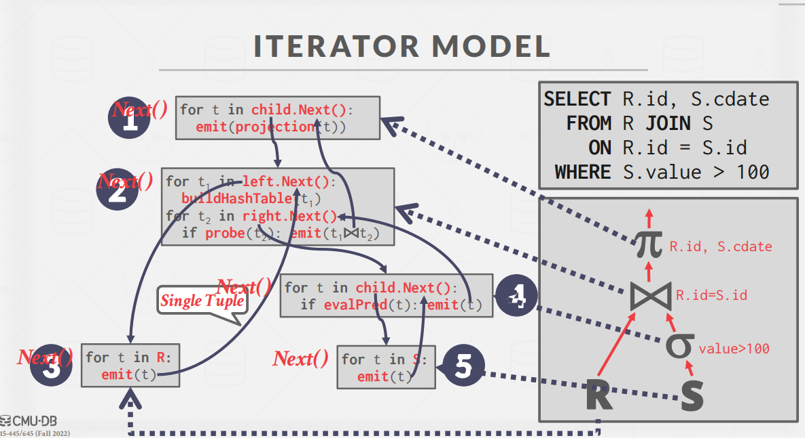
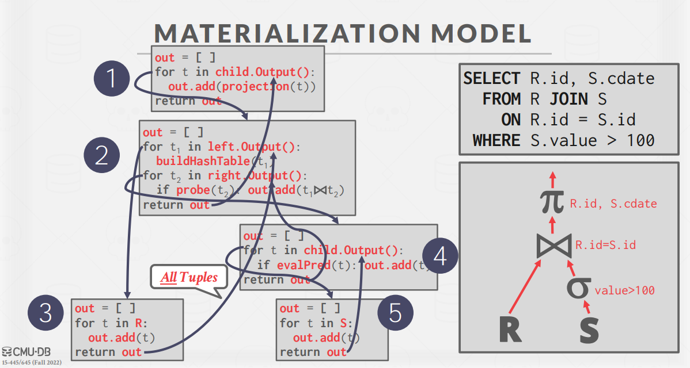
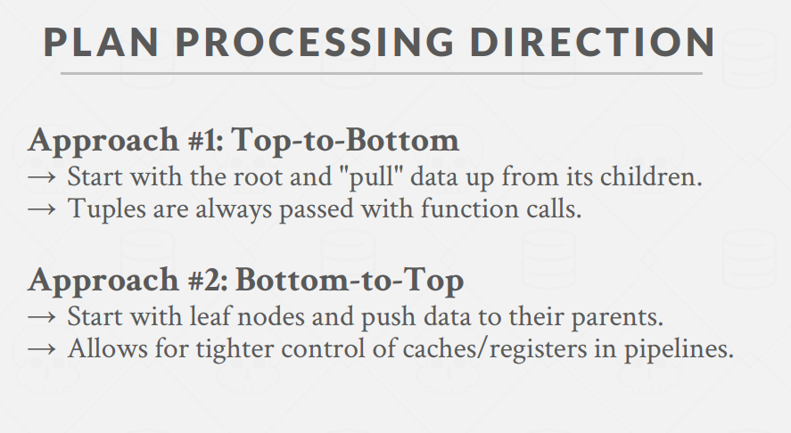
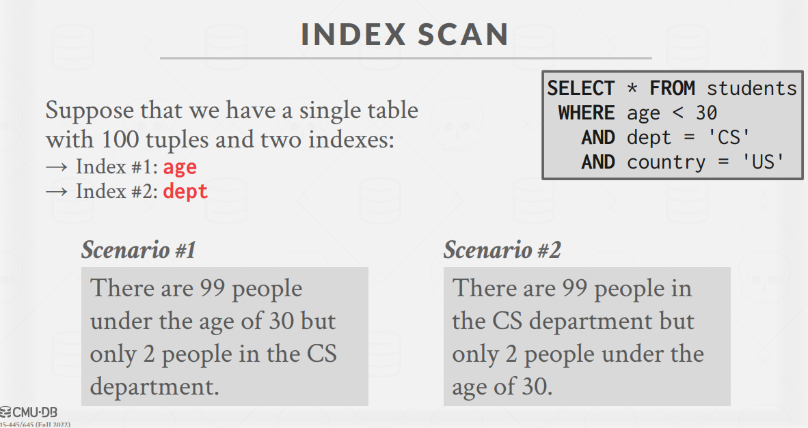
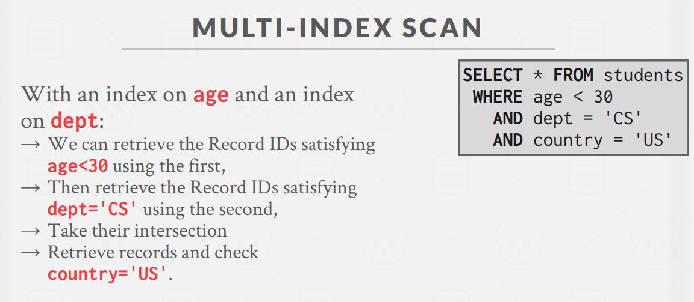
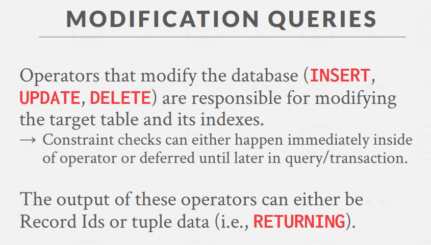
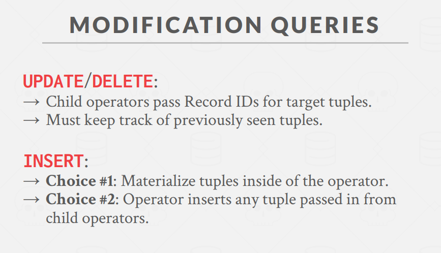
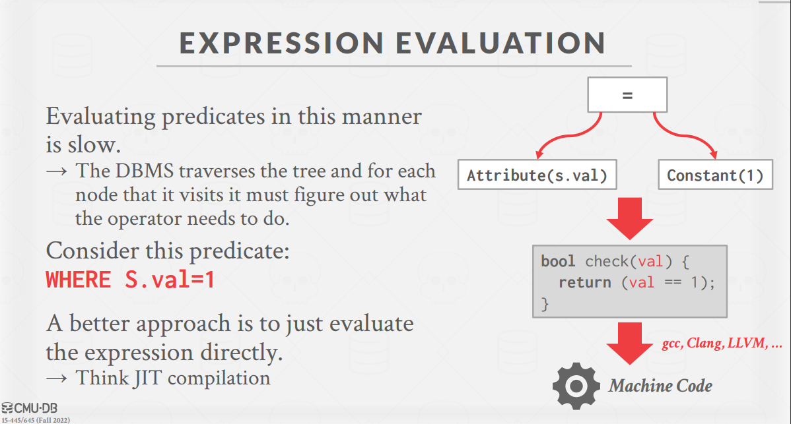

# Operator Execution

- [Operator Execution](#operator-execution)
  - [Query Execution I](#query-execution-i)
    - [Processing Model](#processing-model)
      - [Iterator Model](#iterator-model)
      - [Meterialization Model](#meterialization-model)
      - [Vectorized Model](#vectorized-model)
    - [Processing Direction](#processing-direction)
    - [Access Methods](#access-methods)
      - [Sequential Scan](#sequential-scan)
        - [Optimization: Data Skipping](#optimization-data-skipping)
      - [Index Scan](#index-scan)
      - [Multi-index Scan](#multi-index-scan)
    - [Modification Query](#modification-query)
    - [Expression Evaluation](#expression-evaluation)

## Query Execution I

DBMS 将 `SQL statement` 转换为 `query plan`，`query plan` 中的 `operator` 被组织为一棵树，数据从树的底端（树叶）流向树的顶端（树根）。`Processing model` 用于定义如何执行该查询计划，最基本的三种执行模型如下：

* Iterator model (Volano model & Pipeline model)
* Meterialization model
* Vectorized / Bratch model

### Processing Model

#### Iterator Model

对于当前节点而言，通过对子节点调用 `Next()` 函数获取来自子节点的数据，对于子节点而言也是同理，整个过程是递归执行的。`Next()` 函数每次只传送一个 `tuple`，因此这可以保证整条路径上的各个节点一直处于 `busy` 的状态，这便是流水线思想；另一方面，由于只传送一个 `tuple`，数据量较小，因此**不需要与磁盘进行读写**

有一些 `operator` 会阻塞 `block` 在当前节点（`join, order by, subqueries`），直到它们的子节点发送了所有的数据。当它们接收完子节点的数据后，处理完一个便发送一个

该模型对于输出的控制十分容易，如果只需要十个数据，那么最上层只要接收到十个数据后，便停止调用 `Next()` 函数，这样整个流水线便停了下来

缺点：我一次只能执行一个 `tuple` 这会导致效率不高。因为我每次获取一个 `tuple`，可能会执行很多其余的操作，如果可以一次获取到多个 `tuple`，那么我们便可以摊销 `amortize` 那些多余开销的成本

#### Meterialization Model

每个算子 `operator` 都会一次对所有的输入执行操作，然后再一次性将得到的输出发送到上层的节点中。如果存在对最终结果数量的约束，那么 `DBMS` 会向下传递该约束，以避免扫描过多的 `tuple`

在整个流程中，我们不再是对子节点调用 `Next()` 函数，而是调用 `Output()` 函数，我们将会得到子节点的所有输出（也就是说，这会阻塞当前节点）

这种方式的函数调用会更少，因此相对应的开销也会更小。主要适应于 `OLTP` 类型的负载，因为这种情况下数据量不大。对于数据量大的情况，该模型会多次读写磁盘以保证有足够的空间来一次性传递所有的结果，因此这会导致性能上的开销

#### Vectorized Model

`Iterator model` 与 `Meterialization model` 实际上是两个极端：一个一次只发送一个 `tuple`，一个一次把所有的 `tuple` 全部发送，我们需要一个介于二者之间的模型

`Vectorized model` 同样也有 `Next()` 函数，该函数每次**返回一批 `batch` 数据**。由于一次返回一批数据，因此我们可以使用 `SIMD` 等向量指令来加速执行的过程

只要 `out` 中所含的 `tuple` 的个数大于 $n$，那么我们便可以向上发送这批 `tuple`，这里的 $n$ 我们可以任意指定

该模型适合 `OLAP` 负载，因为它很大地降低了每次运算中函数调用的次数，并且我们可以使用 `SIMD` 等指令来加速每次对一批 `tuple` 的执行

### Processing Direction

我们执行的方向有两种：自顶向下和自底向上。前者从根节点开始，从子节点提取数据，因此数据是以函数调用的形式进行传递的（也就是递归）；后者从叶节点开始，往父节点推送数据，这在流水线中更容易对 `cache` 做控制（我们只需要缓存一次数据，然后每次从 `cache` 中取即可）

### Access Methods

`Access Method` 是 `DBMS` 用于访问那些实际存储在表中数据的方式，主要有三种：

* Sequential scan
* Index scan
* Multi-index scan

#### Sequential Scan

对于表中的每个 `page`，我们直接从 `bpm` 中获取，这样可以减少与磁盘的交互。我们遍历当前的 `page`，逐个检查该 `tuple` 是否满足我们设定的谓词 `predicate`。`DBMS` 需要维护一些本地变量来记录当前遍历的 `page` 以及在 `page` 当中的位置

##### Optimization: Data Skipping

`Data Skipping` 的措施有两种，分为有损和无损

对于有损的方案，我们可以只获取原始表的一个子集，然后对该子集进行查询，进而得到近似的结果。这需要我们能够接收近似的结果这一前提

对于无损的方案，我们会在原始数据 `original data` 在计算出一个对应的 `zone map`，每次我们在扫描该 `page` 时可以先检查 `zone map`，进而确定**是否需要扫描该 `page`**

#### Index Scan

`DBMS` 需要确定该选择哪些 `index` 去找到 `query plan` 需要的那些 `tuple`，在这里，我们默认是 `single index`

对于第一个，我们选择 `dept` 更好，因为所有人的 `age` 都满足条件，因此我们便不需要再做额外的判断了；对于第二个，以此类推

#### Multi-index Scan

如果我们可以使用多个 `index` 来加速查找，那么我们可以按照如下步骤执行：

* 我们首先用匹配的 `index` 去找到对应 `tuple` 的 `Record ID`（也就是 `page id` 和 `slot num`）
* 然后我们依据谓词 `predicate` 来对第一步得到的集合进行合取 `conjunction` 或者是析取 `disconjunction`
* 最后，我们用剩下的 `predicate` 来对第二部得到的集合进行过滤

具体可以参考下面这个例子：

### Modification Query

有一些查询操作会对原始的 `table` 进行修改，因此我们需要去修改原始的 `table`，维护对应的 `index`，以及检查是否满足 `data constrain`

`insert, update, delete` 的具体执行方式如下：

对于 `update` 和 `delete`，子算子 `child operator` 会将目标 `tuple` 的 `RID` 传递给当前算子，因此当前算子直接用 `RID` 去修改对应表中的内容即可

对于这两种操作，我们还需要记录之前执行过的数据，这样可以避免对同一个 `tuple` 执行多次操作 （`Halloween Problem`）

对于 `insert` 操作，有两种选择：

* 在算子 `operator` 内部物化 `meterialize` 需要插入的 `tuple`，然后直接插入
* 在子算子 `child operator` 中完成物化，并将结果传入给专门执行插入操作的算子，并由该算子完成对 `index` 的维护

我们来考虑一下如果不记录之前的数据会造成什么问题：

假设我们要让所有 `salary` 小于 $1100$ 的都加上 $100$。如果前面我找到了一个 `salary` 为 $999$ 的，那么我需要将它在 `index` 中删去，然后将 $1099$ 重新加入到 `index` 中。由于 `index` 是有序的，因此这会被加入到当前光标 `cursor` 的右边。换句话说，我们**在后面还会再次扫描到 $1099$ 这个数据**，然后再次将这个数据修改为 $1199$，这便会导致错误

### Expression Evaluation

查询计划 `query plan` 可以被组织成一颗树的形式，树中的每个节点都是一些操作。在这些操作（主要是 `where clause`）中会有一些运算符，这些运算符本身也可以被解析为一棵树：

我们每次在计算该表达式时，都需要遍历整棵树，这会造成很大的性能开销。这个问题的优化是使用 `just in time` 编译优化

考虑一个等号节点 $N$，如果我们采取遍历树的形式看待，那么我们每次计算 $N$ 时都需要将它的所有子节点都遍历一次。但实际上，我们可以将该节点编译为一个函数，然后每次需要遍历该节点的时候我们都去调用对应的函数，这会很大地提高效率（这么做的前提是，有一个子节点是常数）

在上面这个例子中，我们原本需要**递归遍历**三个节点（一共有三次函数调用），引入优化后我们只需要调用一次函数调用即可完成整个运算

