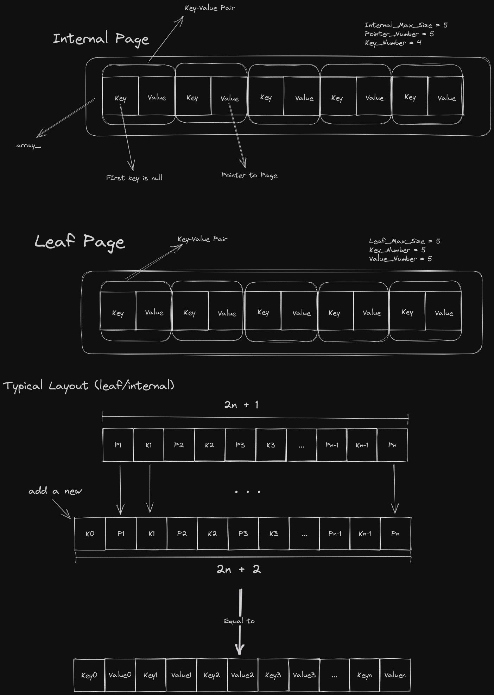
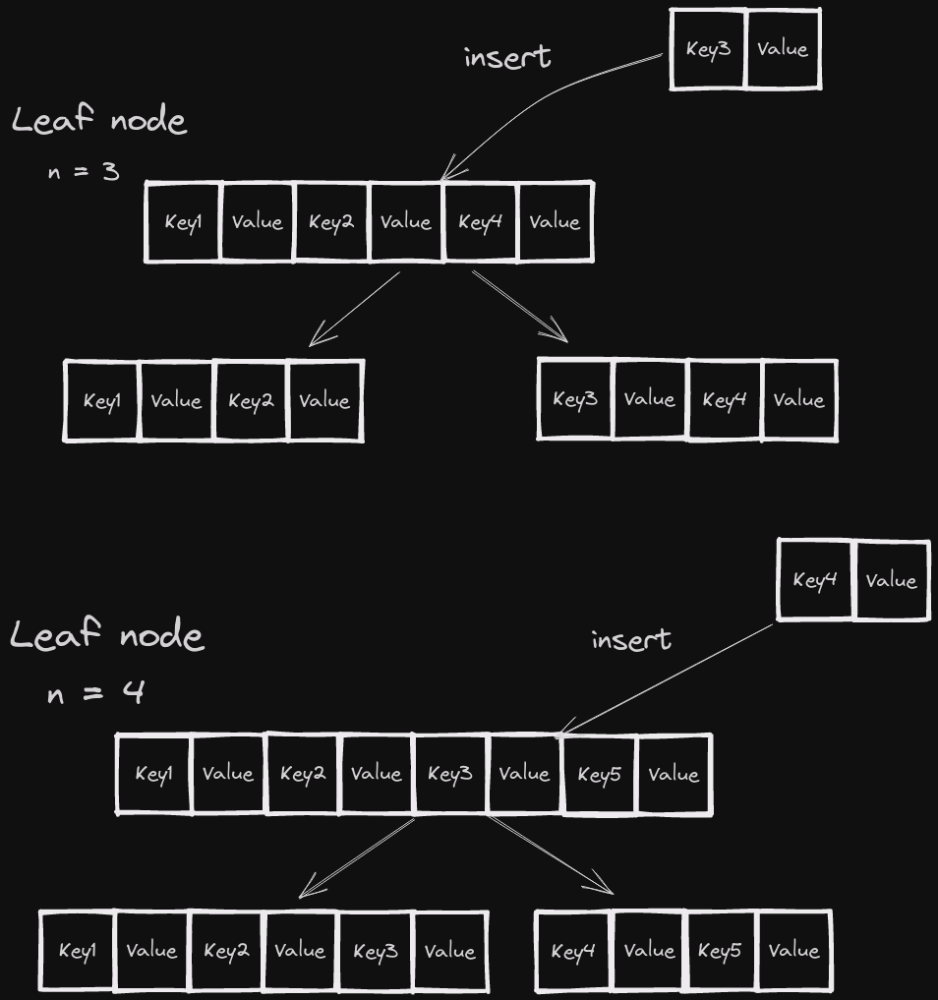
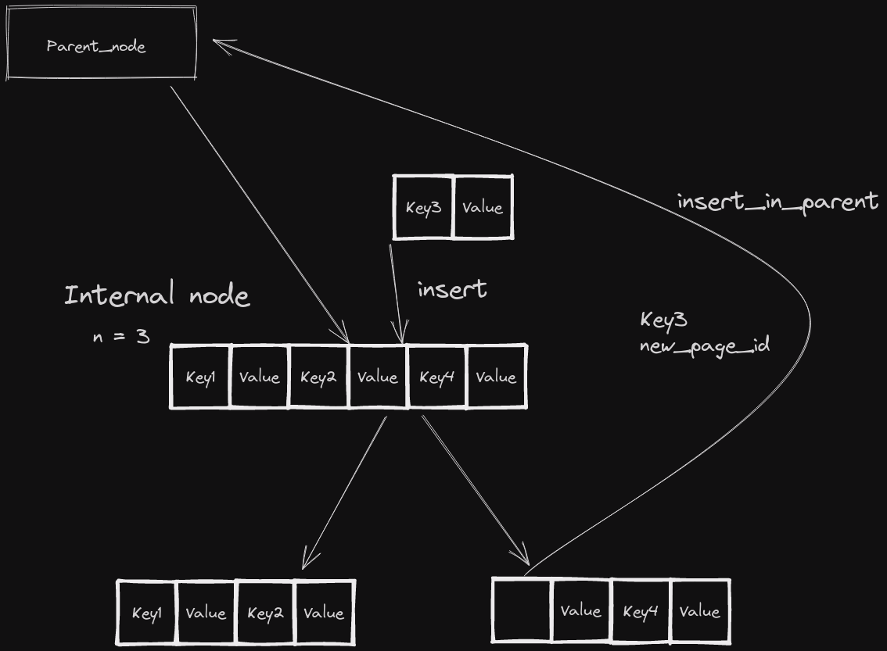
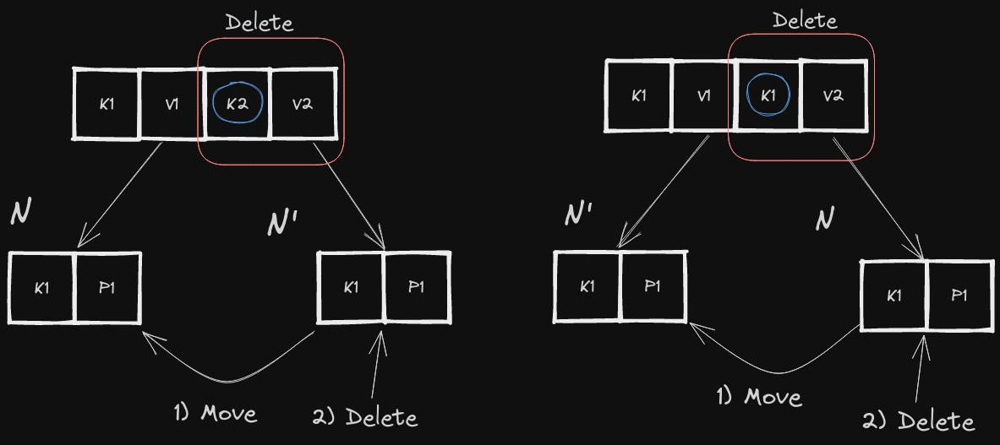
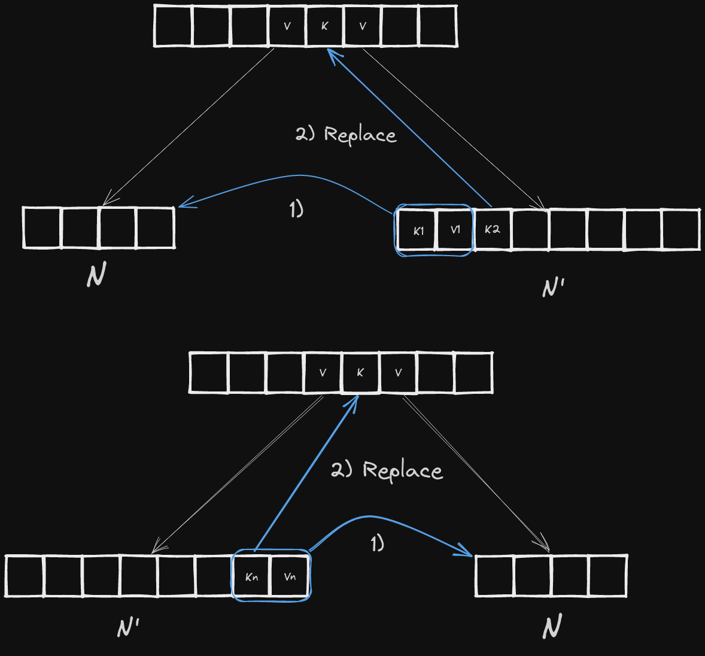

# Project 2

- [Project 2](#project-2)
  - [Checkpoint 1](#checkpoint-1)
    - [Flexible layout](#flexible-layout)
    - [Page Layout](#page-layout)
    - [Binary Search](#binary-search)
  - [Insert](#insert)
    - [Split Leaf](#split-leaf)
    - [Split Internal](#split-internal)
  - [Checkpoint 2](#checkpoint-2)
    - [Delete](#delete)
      - [Determine nearby node](#determine-nearby-node)
      - [Coalesce](#coalesce)
      - [Redistribution](#redistribution)
    - [Iterator](#iterator)
    - [Concurrency](#concurrency)
      - [Crabbing lock](#crabbing-lock)
      - [Data race](#data-race)
      - [Deadlock](#deadlock)


## Checkpoint 1 

### Flexible layout

假设 `B+ Tree` 的 `leaf node` 与 `internal node` 的最大大小分别为：`leaf_max_size` 和 `internal_max_size`，那么：

* `leaf node` 的元素个数最少为：$\lceil (n-1)/2 \rceil$，最多为：$n-1$
* `internal node` 的元素个数最少为：$\lceil n/2 \rceil$，最多为：$n$ 

> 这里有一个问题是，`internal node` 的第一个 `key` 为空，那么其对应的元素个数是否应该也发生改变。实际上，这个问题关系到 `internal node` 的理解，后面有答案

在我们的 `page` 的定义中，无论是 `internal page` 还是 `leaf page`，都是以一个 `pair<KeyTYpe, ValueType>` 为类型的 `flexible array` 作为结尾，因此**二者本质上对于每个元素所采取的存储方式都是一样的**

换句话说，对于 `leaf page`，`flexible array` 中的每一个下标都对应存储一个 `pair`，而 `internal page` 当中的 `flexible array` 中的每一个下标也对应存储一个 `pair`，**唯一不同的是 `internal page` 的第一个 `pair` 的 `first` 不存储元素**

因此，无论是 `internal page size` 还是 `leaf page size`，记录的都是当前该 `page` 已经存储的 `pair` 的数量，不会出现在实际存储的 `ValueType` 一样的情况下，`internal size` 比 `leaf size` 要少一个的情况，二者的下标均是从 $0$ 到 $internal/leaf size - 1$ 

对于二分查找而言，我们查找的对象是 `KeyType`，而 `KeyType` 是存储在 `pair` 的 `first` 部分里面，因此对于 `internal page`，我们需要查找的范围为：$[1,n)$；而对于 `leaf page`，我们需要查找的范围为：$[0,n)$

对于二者的 `flexible array` 的详细结构，可以参考下图：



### Page Layout

`BPlusTreePage` 为 `BPlusInternalPage` 和 `BPlusLeafPage` 的基类，它只提供最基本的三个元素，一共占 `12 bytes`

* `BPlusInternalPage`：`metadata` 占 `12 bytes`；在这基础上增加了一个 `flexible array`，后续的所有内容均由其填充
* `BPlusLeafPage` 在这基础上增加了一个指向下一个 `leaf page id` 的元素，占 `4 bytes`，因此 `metadata` 占 `16 bytes`；剩余的所有内容由 `flexible array` 进行填充

需要说明的是，`B+Tree` 的一个节点占一个 `page`，这里的意思是：**在 `4KB` 的内容中，`B+Tree` 的页面 `metadata` 分别占 `12/16 bytes`，其余的才是每一个 `pair` 存储的内容**。而每个 `page` 自身的 `metadata` 并不会存放在这 `4KB` 当中，这部分的数据是**单独存放的**

值得一提的是，对于 `internal page`，实际上每个 `pair` 的定义是：`pair<KeyType, page_id_t>`，而 对于 `leaf page`，每个 `pair` 的定义是：`pair<KeyType, ValueType>`。我们可以使用在 `b_plus_tree.h` 开头的 `InternalPage` 和 `LeafPage` 来对变量进行定义

在实际的调试过程中，`RID` 一般是占 $8$ 字节而 `page_id_t` 则是 $4$ 字节，如果发现 `internal page` 的 `flexible array` 出现了 $4$ 字节的偏移，那么大概率就是页面的定义出现了错误

> 因此到此为止，我们也就理解了，`internal page` 当中存放的是 $n$ 个元素（也就是 $n$ 个 `pair`），$n$ 个叶节点的 `page_id` 和 $n-1$ 个 `KeyType`

### Binary Search

由于我们需要频繁使用 `std::lower_bound` 和 `std::upper_bound`，因此在这里我们需要对二者的行为详细说明一下：

我们假定待查找区间内的元素为 `element`，我们传入的元素为 `value`

`std::lower_bound` 接受一个范围 $[start, end)$ 作为参数，它会将这个范围划分为两部分，前半部分满足 $element<value$，而后半部分自然是 $element>=value$。该函数会返回第一个使得 `element < value` 为 `false` 的值，也就是**后半区间的起点**

`std::upper_bound` 接受一个范围 $[start, end)$ 作为参数，它同样会将这个范围划分为两部分，前半部分满足 $element<=value$，后半部分自然是 $element>value$。它会返回第一个使得 `value < element` 为 `true` 的值，也就是**后半区间的起点**

举个例子，假设待查找区间为：$[1,2,3,4,5,6,7,8,9,10]$，假设 `value = 5`，那么：

对于 `lower_bound` 而言，区间被划分为：$[1,2,3,4]$ 和 $[5,6,7,8,9,10]$，后半区间的起点为 $5$

对于 `upper_bound` 而言，区间被划分为：$[1,2,3,4,5]$ 和 $[6,7,8,9,10]$，后半区间的起点为 $6$

`std::lower_bound` 和 `std::upper_bound` 都可以传入一个 `predicate` 来自定义比较方式，该 `predicate` 的要求为（两个函数都一样）：只要第一个参数**小于**第二个参数，那么返回 `true`

例如，我们可以这样写（该函数返回 `-1` 表示第一个参数小于第二个参数）：

```cpp
int idx = std::lower_bound(cur_page->array_, cur_page->array_ + cur_page->size_, std::make_pair(key, ValueType()),
                            [&](const MappingType &e1, const MappingType &e2) {
                              return this->comparator_(e1.first, e2.first) == -1;
                            }) -
          cur_page->array_;
```

## Insert

`insert` 函数的大致思路在书中有伪代码给出，在此我们只关注几个重要的点：

### Split Leaf

由于 `leaf page` 最多只能存放 $n-1$ 个元素，因此当其大小**已经**等于 $n-1$ 时，再次插入一个元素就需要进行分裂。而 `internal page` 最多能存放 $n$ 个指针，因此当其大小**已经**等于 $n$ 时，再插入一个元素，就需要进行分裂

书中的伪代码给出的做法是，先将原先旧节点的所有内容复制到一块新开的内存空间当中，然后将待插入的 `pair` 插入进去，最后在分别复制回原先的节点和新的节点

实际上，这一步我们可以简化。我们先确定待插入的 `pair` 应该在旧节点的哪个下标 `idx` 之后进行插入（可以用 `std::upper_bound` 找到），然后再确定总的元素个数 `size` 的大小（这等于旧节点的元素个数 `OldSize` 再加一）

然后，我们可以将旧节点中，区间 $[size/2,idx]$ 复制到新节点，**单独对新的 `pair` 进行复制**，然后再将旧节点中区间 $[idx + 1, OldSize)$ 的值复制到新节点

需要说明的是，这里的 `size` 有可能为奇数，那么我们在分裂后，旧节点和新节点谁多一个元素都是允许的，只要保证前后统一即可。在我们实现当中，我是允许旧节点相比于新节点多一个元素，因为我认为这在一定程度上可以减少未来再次分裂的可能性。如果是这样做的话，那么旧节点的复制区间改为 $[size/2+1,idx]$ 和 $[idx+1,OldSize]$ 即可

具体可参考下图：



### Split Internal

`internal page` 的分裂与 `leaf page` 的分裂在本质上都是一样的，只不过 `internal page` 的分裂多了一个不断向父节点插入新的 `pair` 的过程

由于 `internal page` 的第一个 `key` 为空，因此我们按照 `leaf page` 的分裂方式得到两个节点后，新节点的第一个 `key` 需要置空

由于 `internal page` 有一个向上传递的过程，传递的值为：**新节点的第一个 `key` 以及新节点的 `page_id`**，也就是说我们需要将第一个 `key` 复制一遍后，将其置空，然后将 `pair` 向上传递，这样便完成了 `internal page` 的分裂操作

需要说明的是，在课本当中的伪代码里面，函数的定义为：`insert_in_parent(node N, value K', node N')`。这里的意思是，向节点 `N` 的父节点中插入一个 `pair`，其内容为 `(K', N')`

> 关于如何快速求出当前节点的父节点，由于对父节点插入的前提一定是对叶节点插入，因此我们可以在找叶节点的时候先将这条路径上的每个节点的 `page_id` 记录在 `vector` 里面，然后每次从 `back()` 取值，并 `pop` 一遍，这样子可以保证每次的 `back()` 都是当前节点的父节点

具体参考下图：



---

对于B+树的内部节点，如果是找 `second` 的话，那么不能用二分查找

## Checkpoint 2

### Delete

`B+Tree` 的 `delete` 操作在当前节点不满足 $\lceil n/2\rceil$ 时（也就是 $(n+1)/2$），会发生 `coalesce` 和 `redistribution`，这也是 `B+Tree` 中较为复杂的部分，我们详细讨论这一部分

#### Determine nearby node

无论是 `coalesce` 还是 `redistribution`，我们都需要确定当前节点 $N$ 的相邻节点 $N'$，我们只需要在当前节点 $N$ 的父节点中找到其相邻节点即可。换句话说，$N$ 和 $N'$ 具有相同的父节点

需要注意的是，这里我们只能**逐个遍历**父节点当中的内容，而不能简单地使用二分查找。这是因为我们是在父节点中查找当前节点 $N$ 的 `page id`，而在父节点中，`key` 是有序的，而 `page id` 是无序的，因此我们只能逐个遍历

另外，为了保证与官方提供的 [`bpt-printer`](https://15445.courses.cs.cmu.edu/spring2023/bpt-printer/) 相一致，我们优先选择**后一个节点**。换句话说，只有当前节点是最后一个节点的时候，我们才会选择前一个节点，否则都是选择后一个节点。书中的伪代码是优先选择前一个节点，这样做没有问题，但会与官方提供的 `bpt-printer` 所产生的结果不一致

> 在后面的描述中，我会描述我的实现方法。我是按照官方的 `bpt-printer` 的行为进行设计的，虽然与书中的描述不同，但有可视化的结果进行参考

除了确定相邻节点 $N'$ 以外，我们还需要确定 $N$ 与 $N'$ 之间的那个 `key`，具体如下图：


#### Coalesce

如果当前节点 $N$ 和相邻节点 $N'$ 当中的元素个数**小于等于**单个节点的最大大小，那么我们便执行 `coalesce`

* 对于 `leaf page`，要求小于等于 `leaf_max_size_ - 1`
* 对于 `internal page`，要求小于等于 `internal_max_size_`

对于 `leaf page` 而言，我们只需要将 $N$ 中的所有元素加到 $N'$ 中即可（或者反过来），然后对应设置以下 `next_page_id_` 即可

对于 `internal page` 而言，我们需要将 **`key`** 以及 $N'$ 中的所有元素全部加到 $N$ 中（或者将 $N$ 中的所有元素加到 $N'$ 中）。对于内部节点，由于第一个 `key` 为空，因此我们需要将父节点的 `key` 加入到新合并得到的节点当中，随后再在父节点中删除 `key` 和 $N$（或者 $N'$）

在父节点中，我们是以 `key` 为单位进行删除的，而 `key` 又与其对于的 `page id` 组成了一个整体。为了方便，无论当前节点与相邻节点的位置关系如何，我们**始终删除后一个节点**，具体如下图：



对于 `leaf page` 而言，只是少了将**父节点的 `key` 加入到新合并得到的节点中**这一操作，移动的方向以及删除的节点二者是一样的

#### Redistribution

如果 $N$ 与 $N'$ 的元素个数**大于**单个节点的最大大小，那么我们需要执行 `redistribution`。该操作的本质是**向相邻节点借一个元素过来**

对于 `leaf page` 而言，我们需要考虑二者的位置关系：

* 如果 $N$ 在 $N'$ 的前面，那么我们将 $N'$ 的第一个元素加到 $N$ 的后面，将 $N'$ 中的所有元素向前移动一位，并将**原先父节点当中的 `key` 设置为 $N'$ 的第一个 `key`**
* 如果 $N$ 在 $N'$ 的后面，那么我们将 $N$ 中的所有元素向后移动一位，将 $N'$ 的最后一个元素加到 $N$ 中，并将**原先父节点当中的 `key` 设置为 $N$ 的第一个 `key`**



对于 `internal page` 而言，我们同样需要考虑二者的位置关系：

* 如果 $N$ 在 $N'$ 的前面，我们需要将**父节点当中的 `key` 以及 $N'$ 第一个元素当中的 `second` 加到 $N$ 的后面**，然后将**父节点当中的 `key` 替换为 $N'$ 第一个元素当中的 `first`**，最后将 $N'$ 的所有元素向前移动一位
* 如果 $N$ 在 $N'$ 的后面，我们需要将 $N$ 先向后移动一位，然后将**父节点的 `key` 以及 $N'$ 的最后一个元素的 `second` 加到 $N$ 的前面**，然后**用 $N'$ 的最后一个元素的 `first` 替换掉父节点的 `key`**


### Iterator

对于 `iterator` 的设计，由于该迭代器是只读的，并且我们需要保证在并发的时候不会发生 `data race`，因此我们需要一个 `ReadPageGuard`；另外，我们还需要获取当前 `page` 的下一个 `page`，因此我们需要一个 `bpm` 指针来获取；最后，由于我们需要确定当前 `leaf page` 中的元素的位置，因此需要一个 `const Mapping*` 的指针

实际上有这三个就以及足够了，我的设计当中加入了一个指向当前 `leaf page` 尾部的指针，用于快速确定当前迭代器是否已经遍历到头了

我的定义如下：

```cpp
ReadPageGuard read_guard_;
const MappingType *ptr_;
const MappingType *end_;
page_id_t cur_page_id_;
BufferPoolManager *bpm_;
```

### Concurrency

#### Crabbing lock

并发控制是这个实验最难的一个部分了，我们需要去实现 `crabbing lock`，这里需要用到 `Context` 这个工具

`crabbing lock` 的本质是：对于当前节点而言，如果我们能够确定它的**子节点**是 `safe` 的，那么我们便可以释放**当前节点**的所有祖宗 `ancestors`（**不包括当前节点**）。而一个节点是 `safe` 的当且仅当它不会执行 `split, coalesce, redistribution` 这些操作。换句话说，对于 `insert` 操作而言，子节点的元素个数加一**小于** $n-1$，对于 `delete` 操作而言，子节点的元素个数减一**大于等于** $\lceil n/2\rceil$

因此，我们在向下递归到叶节点时便可以对当前节点的子节点进行判断，进而确定是否需要释放之前的节点

实际上，如果我们确定了当且节点的子节点是安全的，那么**相当于无论子节点发生什么操作，都不会影响到当前节点的之上的节点**。我们不释放当前节点的原因在于，子节点的操作会传递到当前节点，也就是我们需要对当前节点进行修改，因此我们**不能释放当前节点**

对于多线程当中的 `data race` 和 `deadlock`，在此写下一点我的经验

#### Data race

> 需要说明的是，`Race` 和 `Contention` 是两个不同的概念：
> 
> * `Contention` 是指线程 $A$ 以及访问了线程 $B$ 而 $B$ 需要等待 $A$ 将该资源释放
> * `Race` 是指 $A$ 和 $B$ 都想要访问该资源，最快的那个将抢先访问，而慢的那个则只能等待。因此这会导致 `Contention`
>
> 相关链接：[Thread - contention vs race](https://cs.stackexchange.com/questions/126013/thread-contention-vs-race)

对于这种情况，我们可以在全部线程完成插入、删除、查询等操作后，逐一检查 `B+Tree` 当中的数据是否是正确的。换句话说，我们直接对所有的 `leaf page` 进行一次遍历，便可以确定当前存在的元素是否符合预期

#### Deadlock

如果判断产生 `deadlock`，我们直接进入 `cgdb` ，跳转到 `join` 的前一条语句当中。这时所有的线程一定都创建完毕并且开始执行。由于多线程的执行具有随机性，因此我们实际上是无法单步执行某个线程的。因此，我们可以故意让 `deadlock` 发生，然后跳转到对应的线程，通过 `backtrace` 来查看栈帧，并通过 `frame` 指令来跳转到对应的栈帧中，然后再对数据进行检查，进而明确 `deadlock` 发生的原因

