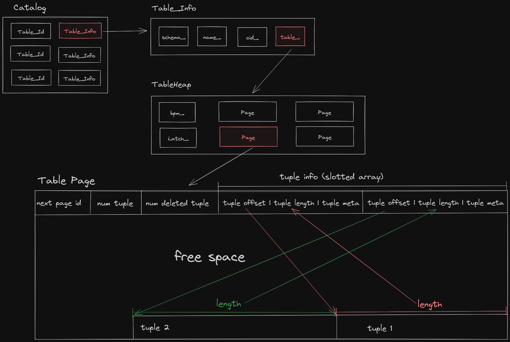
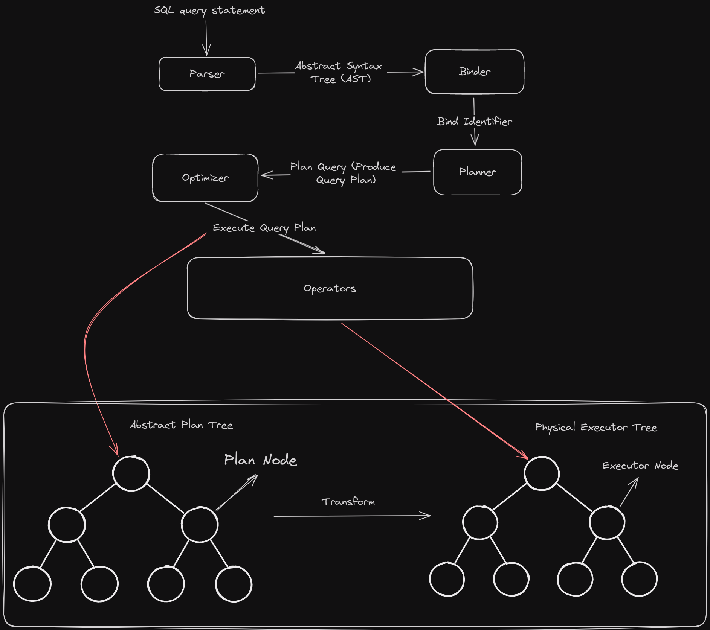

# Project 3

- [Project 3](#project-3)
  - [Architecture Layout](#architecture-layout)
    - [Catalog Layout](#catalog-layout)
    - [Schema Layout](#schema-layout)
    - [Query Execution Tree](#query-execution-tree)
    - [Expression Tree](#expression-tree)
    - [SQL EXPLAIN](#sql-explain)
  - [Task 1](#task-1)
    - [SeqScan](#seqscan)
    - [Insert](#insert)
    - [Update \&\& Delete](#update--delete)
  - [Task 2](#task-2)
    - [Aggregate](#aggregate)
      - [Aggregate Function](#aggregate-function)
      - [Aggregate Semantic](#aggregate-semantic)
      - [Aggregate Implementation](#aggregate-implementation)

## Architecture Layout

### Catalog Layout

`DBMS` 的 `catalog` 用于存储所有 `table` 和 `index` 的读取和写入，因此每当我们需要对 `table` 或 `index` 进行读取或更新时，我们都需要与 `catalog` 进行交互

我们以 `table` 为例，来说明整个 `catalog` 的结构

`catalog` 中用于**存储** `table` 数据的结构为 `TableInfo`，我们可以使用 `table_id` 来索引 `TableInfo`

`TableInfo` 中用于记录 `table` 相关的 `metadata`，实际**存储** `table` 的结构为 `TableHeap`

`TableHeap` 实际上是一系列的 `page`，我们需要将每个 `page` 以 `TablePage` 的形式进行读取，这样才能够正确读取到这个 `page` 内部的 `tuple`

对于一个 `TablePage` 而言，其基本属性如下：

* `num_tuples_`：`tuple` 的数量
* `num_deleted_tuple_`：以删除的 `tuple` 的数量。我们对一个 `page` 当中 `tuple` 的删除是将其 `metadata` 中的标志位进行修改，也就是对其进行 `logical delete`，在我们对 `transaction` 提交后，再执行 `physical delete`
* `tuple_info_`：每个 `tuple` 的元数据，也就是 `slotted array`。我们只记录每个 `tuple` 的偏移量 `offset`、长度 `length`和元数据 `metadata`

`table` 中的每个 `page` 都是以 `slotted array` 的形式存储 `tuple` 的。换句话说，从 `slotted array` 开始，到第一个 `tuple` 为止的这段空间，都是 `free space`

整体的结构如下图所示：



### Schema Layout

由于每个 `tuple` 当中，只有 `RID` 和一个 `vector<char>`，也就是实际存储数据的是一个字符数组，换句话说，所有的 `attribute` 都是存在一起的（每一个 `attribute` 就是一个列 `column`）。因此如果我们想要从 `tuple` 中提取出某些 `attribute`，我们需要在此之上加一个 `schema`，通过 `schema`，我们可以从该 `tuple` 中读取出某些特定的 `attribute`

每一个 `tuple` 都有一个固定的 `schema` 与其对应，因此我们对 `tuple` 进行初始化时，除了需要提供 `Value` 数组以外，还需要提供 `schema`

> `Value calss` 内部封装了各种不同的数据类型，我们可以直接使用 `Value class` 来表示不同的数据

`Schema` 由多个 `Column` 组成，每个 `Column` 都由一个名字 `column_name_`、类型 `column_type_`、该 `column` 在 `tuple` 中的偏移量 `column_offset_`

因此，如果需要创建一个 `Schema`，我们实际上是新建了多个 `Column`，而每个 `Column` 都对应于 `tuple` 中的一个 `attribute`

### Query Execution Tree

对于一条 `SQL` 语句，它所经历的过程如下：



> 可以参考这一篇文章：[BusTub 养成记：从课程项目到 SQL 数据库](https://zhuanlan.zhihu.com/p/570917775)

* `Parser` 会将一条 `SQL` 语句解析为 `Abstract Syntax Tree (AST)`，在 `bustub` 中这里采用系统库
* `Binder` 会将 `AST` 中的每个符号绑定到 `BDMS` 内部每个对象的标识符 `identifier`
* `Planner` 会将 `AST` 输出为查询计划 `Query Plan`
* `Optimizer` 会对 `Query Plan` 进行优化，然后交由 `operators` 进行执行

在这里，对于 `Optimizer` 生成的 `Query Plan`，实际上是一棵树结构（也就是图中的 `Abstract Plan Tree`），每一个节点都是 `AbstractPlanNode`，我们会在**实际执行的时候将该抽象类绑定到具体的 `PlanNode` 上面**

`Operators` 内部的每个 `executor` 会具体执行不同算子的行为，每一个 `Plan Node` 都对应一个 `executor`。同样，所有的 `executor node` 都继承自 `AbstractExecutor`，**在实际执行不同算子的行为时再进行绑定**（也就是图中的 `Physical Executor Tree`）

### Expression Tree

有些 `plan node` 会携带一个表达式，表达式本身被解析为一棵表达式树 `expression tree`，每个节点都为 `AbstractExpression`，**在实际执行的时候，会将各个节点绑定到具体的类上**

每个 `AbstractExpression` 中都有一个 `Evaluate` 函数，用于计算在给定 `tuple` 与 `schema` 的情况下，当前 `expression` 下的值

`Expression` 相关的类放在 `/src/include/execution/expression` 中，我们举个具体的例子

考虑如下 `SQL` 语句：

```SQL
bustub> EXPLAIN UPDATE test_1 set colB = 15445;
=== BINDER ===
BoundUpdate {
  table=BoundBaseTableRef { table=test_1, oid=20 },
  filter_expr=true,
  target_expr=[(test_1.colB, 15445)],
}
=== PLANNER ===
Update { table_oid=20, target_exprs=[#0.0, 15445, #0.2, #0.3] } | (__bustub_internal.update_rows:INTEGER)
  Filter { predicate=true } | (test_1.colA:INTEGER, test_1.colB:INTEGER, test_1.colC:INTEGER, test_1.colD:INTEGER)
    SeqScan { table=test_1 } | (test_1.colA:INTEGER, test_1.colB:INTEGER, test_1.colC:INTEGER, test_1.colD:INTEGER)
=== OPTIMIZER ===
Update { table_oid=20, target_exprs=[#0.0, 15445, #0.2, #0.3] } | (__bustub_internal.update_rows:INTEGER)
  SeqScan { table=test_1 } | (test_1.colA:INTEGER, test_1.colB:INTEGER, test_1.colC:INTEGER, test_1.colD:INTEGER)bustub> EXPLAIN UPDATE test_1 set colB = 15445;
```

我们重点看 `optimizer` 得到的结果。可以看到在 `target_exprs` 中，与两种类型的数据：

* `[#0.0, #0.2, #0.3]`：这对应表达式 `column_value_expression`，其 `Evaluate` 可以直接求出该 `tuple` 对应列的数据。形式 `x.y` 的含义为：
  * `x` 表示 `left side (x == 0)` 或者 `right side (x == 1)`
  * `y` 表示第几列数据，这里分别为第零列、第二列、第三列
* `15445`：这对应表达式 `constant_calue_expression`，我们对其调用 `Evaluate` 可以直接得到具体的值，该表达式也用于存储具体的数值

### SQL EXPLAIN 

我们需要解释一下 `EXPLAIN` 的语句该如何解读，`SQL` 语句的执行可以参考官方提供的 `Shell`: [Live Database Shell](https://15445.courses.cs.cmu.edu/spring2023/bustub/)

还是看上面的那个例子，我们主要看 `PLANNER` 阶段。每一个 `operator` 的形式类似于：`Operator { } | { }`

第一个大括号中用于表示该 `operator` 的相关属性，这主要对应与每个 `executor` 中对应的那个 `plan node`。例如，在 `UpdateExecutor` 类中，含有 `UpdatePlanNode`，而 `UpdatePlanNode` 中的相关属性则正好对应于这里所显示的内容

第二个大括号用于表示该 `operator` 的 `output schema`。由于每个 `executor` 都继承自 `AbstractPlanNode`，也就是每个 `executor` 中都含有 `output_schema_` 属性，第二个大括号中的内容便是这里的 `output_schema_`

## Task 1

在 `Iterator Model` 中，我们每一个 `operator` 都可以对其调用 `Next` 函数，`Next` 函数语义为：

* 若返回 `true`，则表示可以从当前 `operator` 读取 `tuple` 和 `rid`
* 若返回 `false`，则表明当前 `operator` 已执行完毕，**无返回的 `tuple`**

`Next` 函数的语义对于每一个 `operator` 都想同，因此如果**某个 `operator` 没有输出的话，那么其 `Next` 函数需要返回 `false`**

`Init` 函数用于初始化 `operator`，我们在每次调用 `Next` 之前都会调用一次 `Init`

`Task 1` 的四个函数较为简单，这里只将每个函数的关键点写一下：

### SeqScan

`Next` 函数中，由于上层节点会对 `Next` 函数调用多次，因此如果 `table` 中有数据的话，我们每次都需要返回一个 `tuple` 以及 `true`

由于 `tuple` 是逻辑删除 `logical delete`，因此会有一些 `tuple` 会被标记为已删除，那么只要当前 `table` 中有值，那么 `next` 就必须返回一个 `tuple`，不能返回 `false`（有一些被删除的 `tuple` 会混在没有被删除的 `tuple` 中间）

### Insert

`Insert operator` 会将下层子节点传上来的 `tuple` **全部**插入 `table` 和 `index` 中

`InsertTuple` 函数会返回该 `tuple` 在 `table` 中新的 `RID`，因此我们再对索引进行插入时，需要使用新的 `RID` 进行插入

`Insert operator` 的 `Next` 函数返回的 `tuple` 中只有一个 `integer`，用于表示当前已经插入了多少行，因此如果我们插入了 $0$ 个数据，我们也需要返回一个 `tuple` 以及 `true`。如果后面继续调用 `Next`，则返回 `false`，表面当前 `operator` 已执行完对应的操作

### Update && Delete

在我们用**新的 `tuple`** 对 `index` 进行更新时，会需要从 `tuple` 中将 `key` 提取出来。我采用的方法是直接对 `index` 里面的 `key_schema_` 的列进行枚举，如果某一列的**名字**与 `table_info_` 相同，那么我们便将该列记录下来

`delete` 操作感觉上是最简单的。。。。。。

## Task 2

### Aggregate

#### Aggregate Function

我们首先需要对不同的 `aggregate` 函数的行为进行辨别

* 对于 `count(*)` 而言，`null` 值无所谓，但如果本身为空的话需要**初始化为 $0$**（这是因为 `CountStarAggregate expression` 的 `evaluate` 函数会自动返回 $1$）
* 对于 `cound(col)` 而言，不能加入 `null` 值，但如果本身为空需要**初始化为 $1$**
* 对于 `min(), max(), sum()` 而言，不能加入 `null` 值，但初始化时需要用输入值对其赋值

#### Aggregate Semantic

分别运行以下语句，观察其结果

> 为了完善我对 `aggregate` 函数的理解，光是构造这些例子就把我头给搞秃了（小声

```SQL
EXPLAIN SELECT min(colB), max(colA) FROM __mock_table_1;          -- ok
EXPLAIN SELECT colA, min(colB) FROM __mock_table_1 GROUP BY colA; --ok
EXPLAIN SELECT colB, max(colA) FROM __mock_table_1;               -- error
EXPLAIN SELECT colA, min(colB) FROM __mock_table_1;               -- error
```

**`aggregate operator` 的输出，也就是 `output schema` 必须为 `group bys` 和 `aggreagtes`**

---

```SQL
EXPLAIN SELECT min(colB), count(*) FROM __mock_table_1 GROUP BY colA;
EXPLAIN SELECT min(colB), count(*) FROM __mock_table_1;
```

无论 `group bys` 是否为空，`agg operator` 的输出 `output schema` 均不会发生改变，始终为 `group bys` 和 `aggregates`

---

```SQL
CREATE TABLE t1(v1 int, v2 int, v3 int);
EXPLAIN SELECT min(v1), sum(v2), count(*), count(v1) FROM t1 GROUP BY v1;           --ok, output is empty
EXPLAIN SELECT min(v1), sum(v2), count(*), count(v1) FROM t1;                       --ok, output is null value
EXPLAIN SELECT v1, min(v1), sum(v2), count(*), count(v1) FROM t1;                   --error
EXPLAIN SELECT v1, min(v1), sum(v2), count(*), count(v1) FROM t1 GROUP BY t1;       -- ok 
```

对于空表而言，如果存在 `group bys`，那么无输出；如果不存在 `group bys`，那么输出均为 `null value`

并且，对于后一种情况，其 `output schema` 一定与 `aggregates` 相同，否则无法通过

#### Aggregate Implementation

实际上实现是非常简单的，我们只需要按照 `ppt` 上讲的做即可：

在构建 `hash table` 时，我们会对**每个** `tuple` 中，将所有满足 `group_bys` 的属性给取出来，作为 `hash table` 的 `key`。而 `hash table` 的 `value` 则是将**每个** `tuple` 中，**所有**满足 `aggregates` 的属性

注意到 `hash table` 中的 `key` 和 `value` 均为数组 `vector<Value>`。实际上，我们以所有满足 `group_bys_` 的属性作为 `key`，有可能 `group_bys_` 会有多个，因此需要数组来进行存储；而我们输出的 `aggregate` 也有可能有多个，我们也使用数组来进行存储

换句话说，`key` 中的数组表示的是对所有的 `group_bys_` 进行枚举，`value` 中的数组则是每个确切的 `group_bys_` 所对应的多个 `aggregate` 函数

对于 `group_bys_` 为空的情况，做一次特殊判断即可

