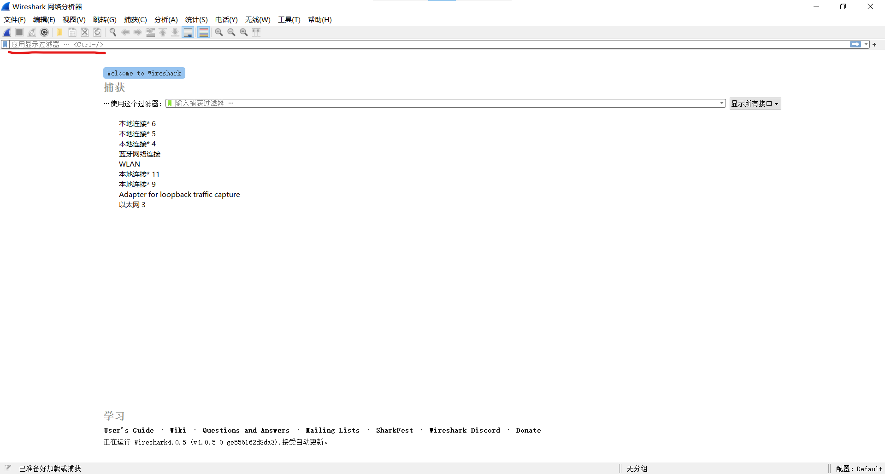
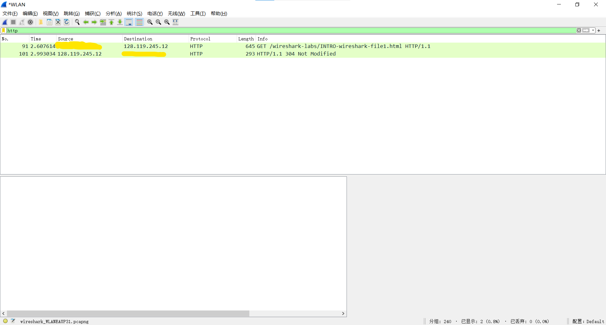

# Wireshark_lab 1

- [Wireshark\_lab 1](#wireshark_lab-1)
  - [准备](#准备)
  - [过程](#过程)

## 准备

实验指导书下载地址：[WIRESHARK LABS](https://gaia.cs.umass.edu/kurose_ross/wireshark.php)

文档翻译可以考虑用：[DeepL](https://www.deepl.com/translator)

`Wireshark` 下载：[WIRESHARK](https://www.wireshark.org/download.html)

## 过程

> 要求：本实验只需要了解相关网络协议的运行即可

下载 `Wireshark` 之后，进入主界面：

在 `应用显示过滤器` 部分，可以对接收到的分组进行过滤

下面显示的均为电脑的不同端口

在上方的下拉窗口中，`捕获` -> `选项` 中可以设置不同捕获端口，在此我们对 `WLAN` 窗口进行捕获

开始捕获后，在浏览器输入：[http://gaia.cs.umass.edu/wireshark-labs/INTRO-wireshark-file1.html](http://gaia.cs.umass.edu/wireshark-labs/INTRO-wireshark-file1.html)

返回 `Wireshark` ，在 `应用显示过滤器` 部分输入 `http`，此时便显示：

可以看到，此时进行了一来一回两次操作，目标 `IP` 为 `128.119.245.12`

第一次客户端（我们）向服务端（对方）发出 `GET` 请求，第二次服务端（对方）向客户端（我们）返回 `304` 信息，两次的时间间隔在 $0.4$ 秒左右

也就是说，`HTTP GET` 请求报文的发送到 `HTTP OK` 回复报文的接收需要大约 $0.4$ 秒左右

下面的两个窗口则是显示一些具体的信息，**左边为数据包的详细信息**，**右边为数据包内容的十六进制和 `ASCII` 显示**

