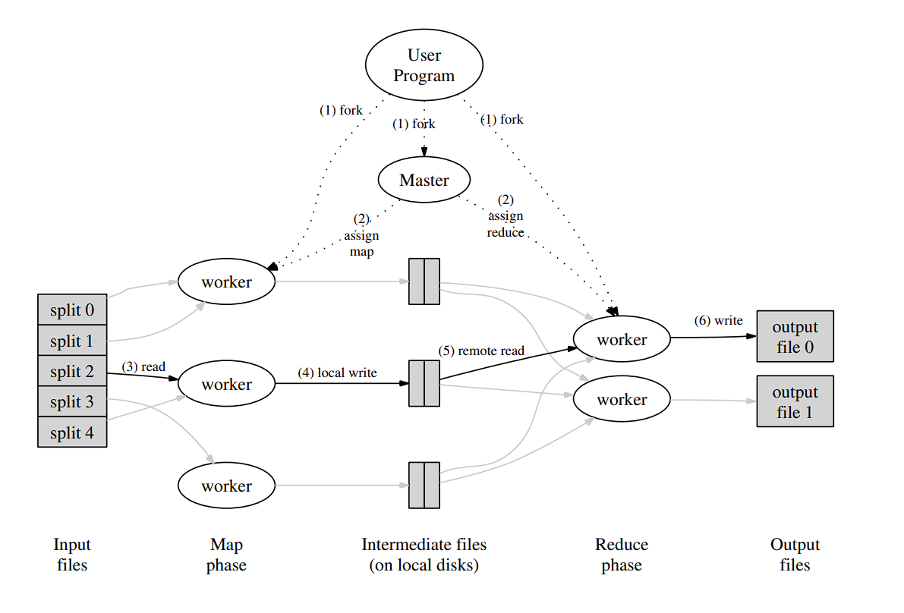

# MapReduce Interpretation 

- [MapReduce Interpretation](#mapreduce-interpretation)
  - [Prerequisite](#prerequisite)
  - [Structure](#structure)
  - [Concepts](#concepts)
  - [Execution](#execution)
  - [Fault Tolerance](#fault-tolerance)
    - [Worker Failure](#worker-failure)
    - [Master Failure](#master-failure)
    - [Atomic Rename](#atomic-rename)
    - [Backup Task](#backup-task)

## Prerequisite

课程主页：[MIT6.5840](https://pdos.csail.mit.edu/6.824/schedule.html)

论文地址：[MapReduce](https://pdos.csail.mit.edu/6.824/papers/mapreduce.pdf)

## Structure

## Concepts

首先需要先解释一些概念：

- `map`：用户自定义函数，以 `key/value pair` 作为输入，将会生成一系列 `intermediate key/value pair (mid-key, mid-value)`。`MapReduce` 框架将会将具有相同的 $\text{key}\ I$ 的中间值收集起来（将会得到 `mid-key, []value`），然后传递给 `Reduce`
- `Reduce`：用户自定义函数，接收 `mid-key, []mid-value`，对其处理后得到**零个或一个输出**

原文描述如下：

> *Map*, written by the user, takes an input pair and produces a set of intermediate key/value pairs. The MapReduce library groups together all intermediate values associated with the same intermediate key $I$ and passes them to the Reduce function.
> 
> The Reduce function, also written by the user, accepts an intermediate key $I$ and a set of values for that key. It merges together these values to form a possibly smaller set of values. Typically **just zero or one output** value is produced per Reduce invocation. The intermediate values are supplied to the user’s reduce function via an iterator. This allows us to handle lists of values that are too large to fit in memory.

- `Worker`：运行在主机上的进程，执行由 `Master` 分配的 `Task`
- `Master`：运行在主机上的进程，负责给各个 `Worker` 分配任务以及协调整个框架的运行
- `Task`：具体运行在 `Worker` 上的不同的任务，分为 `Map Task` 和 `Reduce Task`
- `Job`：整个 `Mapreduce` 执行的所有 `Task` 的总和被称为一个 `job`，每个 `job` 都由一组 `task` 组成

## Execution

- `MapReduce` 框架将输入文件 `input file` 将会被分为 $M$ 个分片 `spilts`，每个部分通常为 $\text{16MB}$ 到 $\text{64MB}$，随后在机器集群上启动程序实例
- 其中一个程序为 `Master`，其余的全是 `Worker`。一共有 $M$ 个 `Map Task` 和 $R$ 个 `Reduce Task` 需要被赋予给 `Worker` 处理。`Master` 将会选择空闲的 `Worker` 来分配任务
- `Map Worker` 读取每个 `input spilt`，执行完毕的结果存储在**本地**
- 对于每个处在本地磁盘的中间结果而言，它们会被 `partition function` 映射成 $R$ 个区域 `region`。随后 `Worker` 将会将这些中间结果的位置发送给 `Master`，`Master` 则负责将位置转发给 `Reduce`
- 当所有的 `Map Worker` 工作完成后，`Reduce Worker` 会被唤醒。后者将会使用 `RPC` 来读取 `Map Worker` 在本地磁盘内的中间结果（**这一步也会产生网络流量**）。当 `Reduce Worker` 读取完所有的中间结果后，会按照 `mid-key` 对输入数据进行排序
- `Reduce Worker` 将会遍历所有已排序完毕的数据，将 `(mid-key, []mid-value)` 传递给用户自定义的 `Reduce` 函数（通常不需要整合所有的输出，因为 `MapReduce` 可以链式连接，前者的输出相当于后者的输入）。每个 `Reduce Worker` 都会产生一个输出文件，其文件名由用户指定

`Map Worker` 需要执行的操作包括：
- 读取输入文件分片 `spilt`
- 调用 `Map` 函数
- 对结果进行 `partition` 并向 `Master` 通知结果存放的位置

`Reduce Worker` 需要执行的操作包括：
- 等待 `Master` 唤醒并告知输入文件的位置，然后通过 `RPC` 进行读取
- 调用 `Reduce` 函数

除此之外，一开始的文件划分则由 `Master` 完成

## Fault Tolerance

`Master` 需要存储各个 **`Map Task` 和 `Reduce Task`** 的状态 `idel/in-progress/completed` 以及标识每个运行 `Worker` 进程的机器。除此之外，`Master` 还需要存储由 `Map Worker` 产生的 $R$ 个区域 `region` 的位置以及文件大小

### Worker Failure

`Master` 会周期性地向各个 `Worker` 发送信号。如果某个 `Worker` 在一段时间内没有回复，那么 `Master` 认为该 `Worker` 崩溃。那么对于该 `Worker` 而言，有两种情况：

- 对于已经完成 `completed` 或正在进行中 `in-progress` 的 `Map Task` 而言，该 `Task` 的状态将会被重新设置为 `idel`，需要重新执行该任务
- 对于正在进行中 `in-progress` 的 `Reduce Task` 而言，会将其状态设置为 `idel`，需要重新执行该任务

对于已完成的 `Map Task` 需要重新执行的原因在于，**它的结果存储在本地**，而那台机器已经故障，因此我们无法访问到那台机器的本地磁盘。对于已完成的 `Reduce Task` 而言，**它的结果存储在全局的文件系统中**，因此不需要重新执行

### Master Failure

我们周期性地向 `Master` 的存储信息当中写入 `checkpoint`。当 `Master` 崩溃时，我们可以重新启动该 `Master` 程序并能够恢复到崩溃前的数据。然而，由于只有一个 `Master`，因此其崩溃通常是概率很小的，因此如果 `Master` 崩溃，论文中的实现会直接将整个 `MapReduce` 计算给 `abort` 掉

### Atomic Rename

当 `Reduce Task` 执行完毕后，会将临时的输出文件 `temporary output file` 重命名为最终的输出文件 `final output file`。而如果有相同的 `Reduce Task` 执行在不同的机器上（`Reduce Task` 被重启过），那么最终得到的输出文件将会完全相同。在此，我们**依赖底层的文件系统**提供的原子重命名 `atomic rename` 来保证最终的输出文件只有一个

### Backup Task

在执行的过程中总会出现落后者 `straggler` 拖慢了整体的运行速度。这些 `straggler` 出现的原因可能是机器本身存在某些故障导致任务的执行速度降低

当 `MapReduce` 操作快结束的时候，`Master` 会将仍在运行 `in-progress` 的 `Task` 备份并同步执行。只要原始的任务或者备份任务执行完毕，那么该 `Task` 将会被标记为完成
