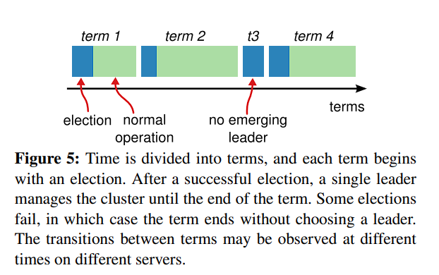
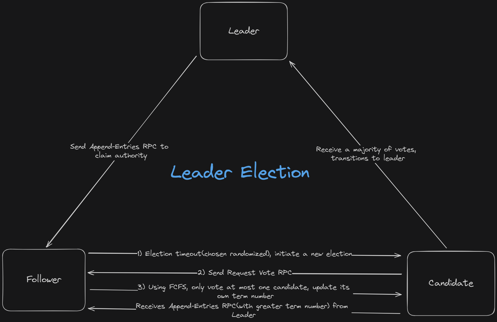

# Raft

- [Raft](#raft)
  - [Replicated state machine \& Raft Properties](#replicated-state-machine--raft-properties)
  - [Raft Basics](#raft-basics)
  - [Raft Principle](#raft-principle)
    - [Leader Election](#leader-election)
    - [Log Replication](#log-replication)

In this article, I will share my Interpretation of the [Raft Paper](https://raft.github.io/raft.pdf). Before delving into the details, it is beneficial to take a brief look at this [virtualization guide](http://thesecretlivesofdata.com/raft/) to gain a better understanding of the context. 

To borrow a sentense from [official web site](https://raft.github.io/), Raft is:

> Raft is a consensus algorithm that is designed to be easy to understand. It's equivalent to Paxos in fault-tolerance and performance. The difference is that it's decomposed into relatively independent subproblems, and it cleanly addresses all major pieces needed for practical systems. We hope Raft will make consensus available to a wider audience, and that this wider audience will be able to develop a variety of higher quality consensus-based systems than are available today. 

## Replicated state machine & Raft Properties

To begin, let's explore the architecture of replicated state machine, as depicted in the following figure. The server, equip with the consensus module, can be conceptualized as state machine. The replicated state machine, essentially an alias for the replicated server, is implemented using replicated log. The log comprises a sequence of commands slated for execution, and the consensus module oversees the management of this replicated log.

When a server applies a log entry to state machine, it means that the state machine executes the content of that log entry. The term "commmitted" for log entry indicates that it has been safely execute by the state machine.

Raft consistently ensure the validity of these properties at all times.

- *Election Safety*: at most one leader can be elected in a given term.
- *Leader Append-Only*: a leader never overwrites or deletes entries in its log; it only appends new entries.
- *Log Matching*: if two logs contain an entry with the same index and term, then the logs are identical in all entries up through the given index.
- *Leader Completeness*: if a log entry is committed in a given term, then that entry will be present in the logs of the leaders for all higher-numbered terms.
- *State Machine Safety*: if a server has applied a log entry at a given index to its state machine, no other server will ever apply a different log entry for the same index.

## Raft Basics

The Raft cluster comprises multiple servers. At any given of time, each server is in one of three state: *leader*, *candidate* and *follower*. Under normal execution, only one leader functions as the leader while the remaining servers act as followers. Leader handles all request from client and follower respond to request issued by leader. If clinet contacts a follower directly, the followers will redirect this request to leader. The candidate state is used to elect a new leader, and the transitions between these three states are depicted in the following figure:

The interpretation of this figure will be discussed below.

Raft divides time into *terms* in arbitrary length, with terms numbered consecutively. Each term commences with an election, during which only one server wins and becomes leader. The rest of the term involves the execution of the Raft protocol, as shown in the following figure. In some situations, election may lead to two or more leaders, called split vote. In this case, the term will end with no leader and immediately start a new election.

Terms in Raft act as a logical clock, with each server stores a *current term number* that increase monotonically over time. The current term is exchanged whenever servers communicate with each other. **If a server's current term is outdated compared to another server's current term, it updatas its current term to the larger value. Candidate and leaders, upon discovering outdated current term, revert to being follower. If server receives request with a stale current number, it rejects responding it.**

Servers in Raft communicate using RPC(remote procedure call) and there are two types of RPC in Raft: Request Vote RPC, initiated by candidates to request votes from follower during election, and Append-Entries RPC, initiated by leader to replicate log entries and provide a heartbeat mechanism.

## Raft Principle

In this section, we will delve into three subproblems—*Leader Election*, *Leg Replication* and *Safty*—decomposed by Raft in order. Notably, the safty aspect is restrition to leader election and log replication.

### Leader Election

There are two types of timeout setting in Raft: **heartbeat timeout** and **election timeout**. When server starts up, it begins as a follower. A server remains in follower state as long as it consistently receives valid RPCs(irrespective of their type) from a candidate or leader. Leader periodically sends Append-Entries RPCs, without log entries, to all follower to prevent the initiation of a new election by follower. This mechanism is called heartbeat mechanism and the interval for sending Append-Entries RPC is defined as the **heartbeat timeout**. If follower receives no communication a specified period, known as the **election timeout**, it assumes there is currently no leader and initiates a new election.

When one follower initiates a new election, it **increments its current term number and transitions to candidate state.** The candidate then **votes for itself and sends Request Vote RPCs in parallel to each of the other server** in cluster. Candidate remains this state **unless** one of three events occurs: it wins the election, another candidate wins the election or no candidate wins the election.

A candidate wins the election if it receives a majority of vote(usually greater than half) from the other server in the full cluster. Each server votes at most one candidate using a first-come-first-serve approach in a given term. When a server votes for a candidate, it update its current term to the greater of the two. we assumes that the term of candidate is greater than the term of another server; otherwise, the server will reject voting for that candidate. Once candidate wins the election, it become leader and immediately send heartbeat message(which is an Append-Entries RPC but carries no log entries.) to other server to prevent the initiation of a new election by followers.

While waiting for votes, a candidate may receive an Append-Entries RPC from another 'leader' claiming its autority. The candidate then compares its own term with the term in the Append-Entries RPC. If the term in Append-Entries RPC is greater than the candidate's term, the candidate reverts to follower state; otherwise, it will reject this RPC and remain candidate state.

The thrid situation is when neither candidate wins nor loses election. If the election timeout of many followers expires simultaneously, they will transition to the candidate state and votes could be split among these candidate, preventing any candidate from receiveing a majority of votes. With no winner, all candidates revert to follower, and then they will once again experience the experiation of their election timeout simultaneously. This situation will indefinitely repeat without any additional mechanism.

Raft utilizes a randomized election timeout to address this issue. **Election timeouts are chosen randomly from a fixed interval(e.g. from 150ms to 300ms).** With no two server haveing the same election timeout, the occurrence of split vote is rare and the issue can be resolved quickly.

The structure of leader election is shown as the following figure: 

### Log Replication

