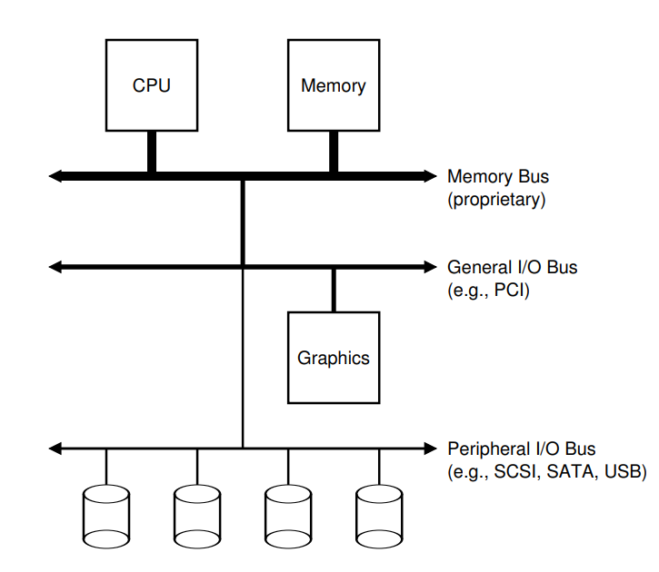
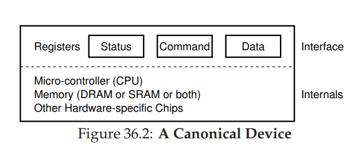
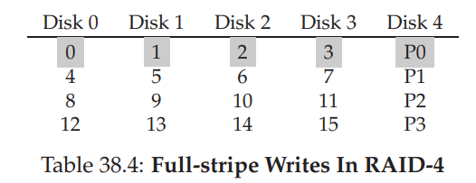
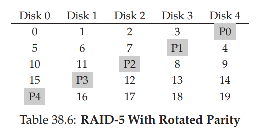

# Persistence

- [Persistence](#persistence)
  - [Introduce](#introduce)
  - [Device Interface \& Disk](#device-interface--disk)
    - [System Architecture](#system-architecture)
    - [Canonical Device](#canonical-device)
  - [Redundant Array of Inexpensive Disk](#redundant-array-of-inexpensive-disk)
    - [RAID Level 0: Striping](#raid-level-0-striping)
    - [RAID Level 1: Mirroring](#raid-level-1-mirroring)
    - [RAID Level 4: Saving Space With Parity](#raid-level-4-saving-space-with-parity)
    - [RAID Level 5: Rotating Parity](#raid-level-5-rotating-parity)
  - [File \& Directory](#file--directory)

## Introduce

为了让数据能够更为持久的保存，需要硬件（磁盘 `disk`）和软件（文件系统 `file system`）之间的合作完成，在此我们简单的讨论一下操作系统如何与设备进行通信，我们关注的重点在于文件系统这部分

## Device Interface & Disk

### System Architecture

一个标准的系统架构如下图所示

图中越粗的线表示的速度越快，`CPU` 通过内存总线 `Memory Bus` 与系统内存相连；图像处理（显卡 `Graphics`）或者高性能设备通过通用 `I/O` 总线 `General I/O Bus` 与系统相连；**磁盘**、鼠标通过最外围的外围总线 `Peripheral I/O Bus` 连接到系统。也就是说，硬盘与系统的交换实际上是很慢的

### Canonical Device

一个标准设备 `Canonical Device` 的接口与内部如下所示：

外部接口 `interface` 由三个寄存器组成：状态 `status`、命令 `command`和数据 `data`；内部组成 `internals` 由硬件构成：微处理器、内存和其他硬件芯片

操作系统与设备的交换主要通过设备提供的接口实现。`status` 寄存器可以读取并查看当前设备的状态；`command` 寄存器可以通知设备执行某个具体的命令；`data` 寄存器可以将数据传送给设备或从设备中读取数据

一个标准的与设备通信的协议分为以下四部：

1. 操作系统反复读取 `status` 寄存器，等待设备进入可以接收指令的状态，这称为轮询 `polling`
2. 操作系统将**数据**下发到 `data` 寄存器，这个过程中如果 `CPU` 参与数据移动我们称这个过程为 `Programming I/O`
3. 操作系统将命令写入 `command` 寄存器
4. 操作系统反复轮询该设备，判断命令是否执行完毕

当然，这个过程中有很多部分是可以优化的，例如操作系统可以使用中断来避免反复轮询，通过使用 `DMA, Direct Memory Access` 来避免 `Programming I/O`，可以进一步释放 `CPU` 的时间

由于每个设备的接口都不一样，为了将不同的设备纳入操作系统，操作系统需要有这些设备的设备驱动程序 `Device Driver`，通过这一层抽象，操作系统便可以对设备进行操作了（`Linux` 系统中有 `70%` 的代码都是各种驱动程序）

## Redundant Array of Inexpensive Disk

> 我们不讨论磁盘如何设计，我们只关注如何利用磁盘构建一个大型、快速、可靠的存储系统

廉价冗余磁盘阵列（`Redundant Array of Inexpensive Disk`）是将多个磁盘构建成一个更快、更大、更可靠的文件系统。从外部看，`RAID` 是一个磁盘，包含一系列可用读取和写入的块；从内部看，`RAID` 由多个磁盘、内存和一个或多个处理器构成

从性能 `Performance` 上来说，并行地使用多个磁盘可用加快 `I/O` 速度；从容量 `Capacity` 上来说，使用多个磁盘可以显著地提高容量；从可靠性 `Reliability` 上来说，允许一定程度的冗余能够保证系统在部分磁盘损坏的情况下还能正常工作。这三个方面也是评估 `RAID` 的三个指标

`RAID` 的设计有三种：`RAID Level 0 (Striping), RAID Level 1 (Mirroring), RAID Level 4/5 (Parity-Based Redundancy)` 

### RAID Level 0: Striping

这个级别的 `RAID` 没有冗余，它按照条带化 `Striping` 的方式将磁盘阵列中的块组织在磁盘上。我们将同一行中的块 `block` 称为条带，如下图（这里我们假定有四个磁盘 `disk`，每个 `block` 的大小为 `4KB`）：

在这里，每一条 `stripe` 包含四个 `block`，大小为 `16KB`，**一共有四条 `stripe`**。当然，我们也可以将相邻的两个 `block` 放在同一个磁盘上以此构成一个 `chunk`，那么每个 `chunk` 的大小为 `8KB`，每一条 `stripe` 包含四个 `chunk`，大小为 `32KB`，**一共有两条 `stripe`**，如下图：

在这里，如果 `chunk size` 过小，也就意味着许多文件可用跨越多个磁盘，这增加了文件并行读取的效率，但会增加跨多个磁盘访问的定位时间；相应地，如果 `chunk size` 过大，则会减小这种并行性，但定位时间则会降低

在评价性能时，我们主要考虑两种工作负载 `workload`：顺序 `sequential` 和随机 `random`。对于前者，我们假定对阵列的请求大部分是连续的；对于后者，我们假定每次请求都很小，并且随机分布在磁盘上的不同位置。我们设 `sequential` 下以 $S\ \rm MB/s$ 传输数据，`random` 下以 $R\ \rm MB/s$ 传输数据

> 我们简单计算一下二者的差距，假设我们的磁盘的属性如下：
> 
> * 平均寻道时间 $7\ \rm ms$
> * 平均旋转延迟 $3\ \rm ms$
> * 磁盘传输速率 $50\ \rm MB/s$
> 
> 我们设 $10\ \rm MB$ 为连续传输，$10\ \rm KB$ 为随机传送，那么有：
> 
> $$
> \begin{align*}
> &S=\frac{10\rm MB}{(7 + 3 + 200)\rm ms} = 47.62\ \rm MB/s\\
> &R=\frac{10\rm KB}{(10+\frac{10\rm KB}{50\rm MB/s})\rm ms}=0.981\ \rm MB/s
> \end{align*}
> $$
>
> 二者相差了 $50$ 倍

从性能的角度来看，单个块的请求延迟与磁盘延迟相一致；从容量的角度来看，我们并没有冗余，因此 $N$ 个磁盘全部用于存储数据；从可靠性的角度来看，顺序**吞吐量**为：$N\times S$，随机**吞吐量**为：$N\times R$

> 需要说明的是，吞吐量等价于后面所说的带宽

### RAID Level 1: Mirroring

`RAID 1` 仅仅是在 `RAID 0` 的基础上添加冗余，如下图：

对于镜像 `mirror` 阵列，读取时可以读取任意一个副本。但在写入时，则需要更新两个副本的数据，以保持数据的可靠性。由于冗余分布在不同的磁盘上，因此这些写入可以**并行**进行

> 我们可以同时对多个磁盘进行并行读写，但对于单个磁盘的读写只能按顺序执行。因此我们选择**将冗余分布在多个磁盘而不是单个磁盘上**

从容量的角度来看，在有 $N$ 个磁盘的前提下，可以用作存储的空间为 $N/2$；从可靠性的角度来看，`Merror Level = 2`的 `RAID` 最多允许 $N/2$ 个磁盘发生损坏（运气爆炸的情况下）；最后我们分析性能，这其实稍微有点复杂

对于**顺序写入**，由于我们可用的磁盘实际上只有 $N/2$ 个，因此**顺序写入**的峰值带宽为 $\frac{N}{2}\times S$（也就是我们只能使用 $N/2$ 个磁盘进行顺序读取）

而对于**顺序读取**，直观上来看，我们可用从两个磁盘中任意读取一个，貌似会比写入的性能更好，但不幸的是，**顺序读取的峰值带宽**依旧为 $\frac{N}{2}\times S$，我们具体分析一下这个问题：

由于对每个 `block` 的读取可以来自两个磁盘，因此如果读取 `block 0, 1, 2, 3, 4, 5, 6, 7`，我们假定它们分布被定位到 `disk 0, 2, 1, 3, 0, 2, 1, 3`。发现问题了吗，**对于同一个磁盘而言，两次读取的块并不是连续的**，因此在这种情况下每个磁盘只能提供其峰值带宽的一半，因此顺序读取的峰值带宽依旧为 $\frac{N}{2}\times S$

对于**随机读取**，我们可以使用全部 $N$ 个磁盘进行随机读取，因此其峰值带宽为 $N\times S$

对于**随机写入**，由于只能使用 $N/2$ 个磁盘，因此其峰值带宽为 $\frac{N}{2}\times S$

### RAID Level 4: Saving Space With Parity

我们可以通过向磁盘阵列中添加奇偶校验 `parity` 来提供数据恢复，但这种方式的代价是性能

`disk 4` 用于提供奇偶校验块，这个块的加入使得在同一条带下允许某个块出现损坏

我们考虑用异或 `XOR` 来实现奇偶校验。对于一组 `bits` 而言，如果其中有偶数个 `1`，那么异或的值为零；如果有奇数个 `1`，那么异或的值为一，即：

在第一行中，由于存在两个 `1`，因此结果为 `0`；第二行中由于存在一个 `1`，因此结果为 `1`。加入了奇偶校验后，我们可以允许任意一个 `block` 发生损坏，假设 `C2` 列发生损坏（也就是两个 `block`），我们可以**依据奇偶校验的结果重构 `reconstruct` 出 `C2` 列原先的值**，这便实现了数据的可靠性

需要说明的是，我们只能允许一列发生故障，如果多于一列，那么数据将无法重建

当我们将 `XOR` 用于块，我们只需要对每一个条带中的 `block` 各个位依次异或，将得到的结果存放在奇偶校验 `disk` 中即可：

现在我们来分析 `RAID 4`。从容量的角度来看，由于使用了一个磁盘作为奇偶校验盘，因此实际存储数据的只有 $N-1$ 个磁盘，也就是容量为 $N-1$；从可靠性的角度来看，**至多允许一个磁盘发生故障**，而如果过多的磁盘发生故障，那么无法重建原先的值

对于**顺序读取**，我们会用到除奇偶校验之外的所以磁盘，因此顺序读取的峰值带宽为 $(N-1)\times S$

对于**顺序写入**，在将大块数据写入磁盘时，`RAID 4` 可以做一种简单的优化，被称为全条带写入 `full-stripe wirte`。在下图中，假设需要对 `block 0, 1, 2, 3` 进行写入，那么 `RAID` 会对这些**新块**计算 `P0` 的新值，然后将**五个**磁盘并行地写入

因此，在 `RAID 4` 上顺序写入的性能就很容易分析了，我们至多只能使用 $N-1$ 个磁盘，因此峰值带宽为 $(N-1)\times S$

对于**随机读取**，某个 `block` 可以随机地分布在 $N-1$ 个磁盘上，因此峰值带宽为 $(N-1)\times R$

对于**随机写入**，情况则相对复杂一点。在上图中，我们假设对 `block 1` 进行写入，我们可以直接用新值覆盖旧值，但我们需要更新 `P0` 的值，这里有两种方法：

第一种方法是加法奇偶校验 `additive parity`：为了计算新的奇偶校验块的值，我们需要读取其他所有 `block` 的值（在这里，我们需要读取 `block 0, 2, 3` 的值），然后将 `P0` 的新值写入。这种方法有一个明显的问题是，如果同一 `stripe` 的 `block` 数量过多，就会导致很大的读取流量，因此还有一种的方法

第二章方法是减法奇偶校验 `subtractive parity`：我们考虑一个简单的例子，想象有四个数据位和一个奇偶校验位：

我们希望用一个新值来覆盖 $C2$，设为 $C2_{new}$。我们首先读入 $C2$（也就是 $C2_{old}=1$）和 $P_{old}=0$

我们需要比较新数据和旧数据，如果二者相同，那么奇偶校验位不变，即 $P_{new}=P_{old}$；如果二者不同，那么我们需要**将奇偶校验位翻转**。也就是说，如果 $P_{old}=0$，那么 $P_{new}=1$，反之同理。我们可以用以下式子表示这个过程：

$$
P_{new}=(C_{old}\oplus C_{new})\oplus P_{old}
$$

由于我们处理的对象是 `block`，但我们依旧可以沿用这种做法，只需要将 `block` 中的每一位按照上述操作执行即可

还是刚刚的例子，如果我们使用 `additive parity`，那么我们需要执行六次物理 `I/O`（四次用于读取四个数据位，剩下两次分别用于对新块和奇偶块的写入），如果我们使用 `substractive parity`，那么我们只需要四次物理 `I/O`（两次读取数据块和奇偶块的旧值，两次写入数据块和奇偶块）

这里我们考虑并行执行写入时 `RAID 4` 的效率，我们分别写入 `block 4, 13`，那么我们需要对 `P1` 和 `P3` 进行修改，如下图：

这里的问题是，我们确实可以并行读取和写入 `block 4` 和 `block 13`，但对于奇偶块的更新，`P1` 和 `P3` 的读取和写入只能**顺序执行**。因为我们只能对不同的磁盘并行进行读写，但对于同一个磁盘只能顺序读写，而 `P1` 和 `P3` 恰好在同一个磁盘上

对于每一次逻辑 `I/O`，奇偶校验磁盘都会对应执行两次 `I/O`（一次读取，一次写入），因此对于**随机写入**，**峰值带宽**仅仅为 $R/2$（这种问题被称为小写入问题）

> 随机写入的速度为 $R$，而由于奇偶块的瓶颈，每次对奇偶块的写入都会转化为顺序两次操作，因此速度退化为 $R/2$
>
> 这种情况下，**因为无论我们加多少磁盘，都无法改变其带宽**

我们最后分析以下 `RAID 4` 中的 `I/O` 延迟，对于单次读取，其延迟等同于单个磁盘的请求延迟；而对于单次写入，则需要两次读取（读取同一 `stripe` 中的数据块和奇偶块）和两次写入（写入同一 `stripe` 中的数据块和奇偶块），由于读取可以并行执行，写入也可以并行执行，因此总体上等于两倍磁盘的延迟

### RAID Level 5: Rotating Parity

我们将奇偶块的分布改为跨磁盘旋转，如下：

由于 `RAID 5` 的设计与 `RAID 4` 的设计几乎一致，加入旋转是为了解决小写入问题，因此在随机写入的性能上，总带宽将变为 $\frac{N}{4}\times R$，这里 `4` 倍的损失是因为每次写入依旧会造成额外的 `4` 个 `I/O` 操作

最后是一个总结性的表格，如下：

---

## File & Directory

