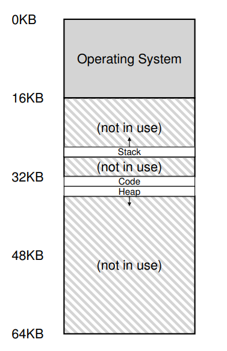
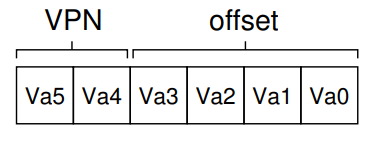
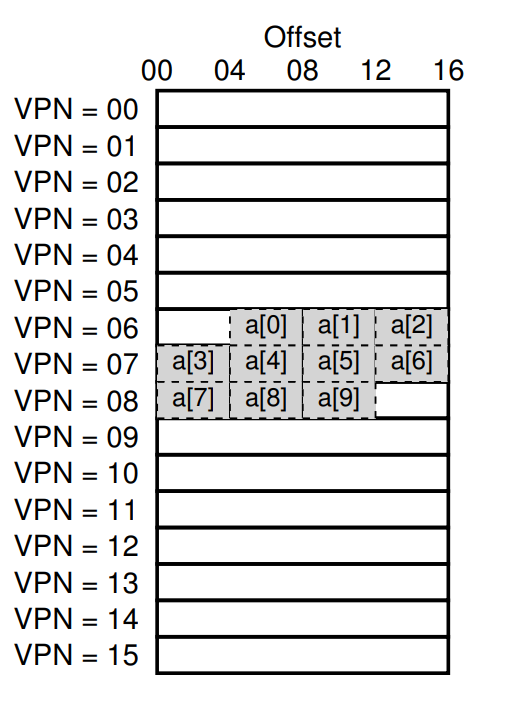
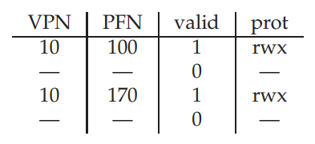
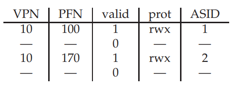
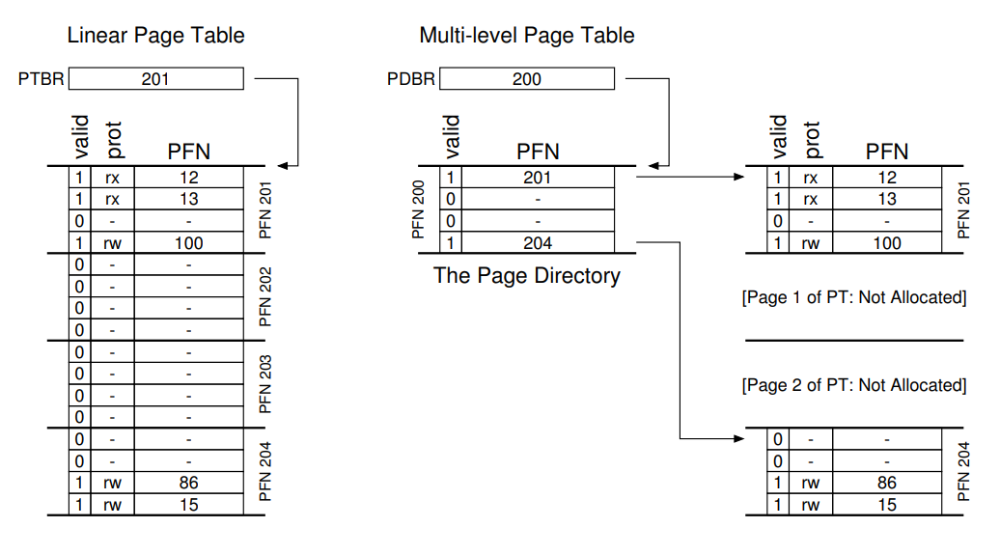
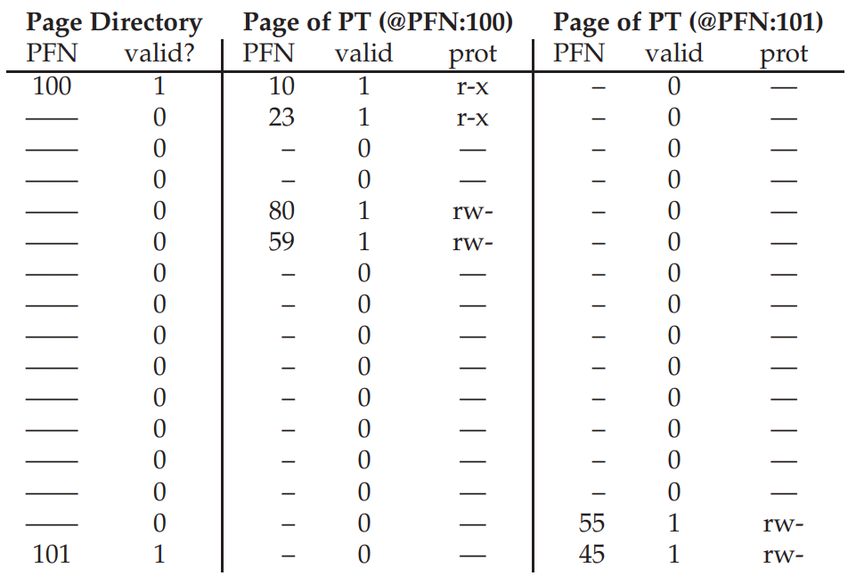

# 内存虚拟化

- [内存虚拟化](#内存虚拟化)
  - [概述](#概述)
  - [抽象：地址空间](#抽象地址空间)
  - [机制：地址转换](#机制地址转换)
  - [分段](#分段)
  - [分页](#分页)
    - [原理 \& 页表](#原理--页表)
    - [页表内容](#页表内容)
    - [分页速度](#分页速度)
  - [Temporal Approach: Translation-lookaside buffer (TLB)](#temporal-approach-translation-lookaside-buffer-tlb)
    - [TLB Basic Algorithm](#tlb-basic-algorithm)
    - [Contents \& Context switch](#contents--context-switch)
  - [Spatial Approach: Multi-level Page Table](#spatial-approach-multi-level-page-table)
    - [More than two level](#more-than-two-level)
    - [Algorithm Description](#algorithm-description)
  - [Beyond Physical Memory](#beyond-physical-memory)

## 概述

用户程序所能看见的地址均为**虚拟地址**，应用程序所生成的地址也为虚拟地址。操作系统为每个进程提供一个**假象**，即每个进程都拥有**大量的私有内存**，而操作系统在硬件的帮助下会将这些虚拟地址变为真实的物理地址，这便是内存虚拟化

## 抽象：地址空间

处于交互性 `interativity` 的需要，操作系统需要实现**时分共享**，而最简单的办法是将一个进程占用全部内存运行一段时间，然后停止它并将其**所有的状态信息保存在磁盘上（包括所有的物理内存）**。但这样有一个问题是，运行的太慢了，仅仅是保存寄存器等状态信息的速度还相对较快，但保存所有的内存信息到磁盘就太慢了。因此操作系统在**执行进程切换时，仍将进程的信息保存在内存中**（此时我们讨论的内存为物理内存）


如上图所示，每个进程都拥有**全部物理内存** $512kb$ 的一小部分，操作系统每次运行一个进程，而其余的进程则在队列当中进行等待（它们的状态信息依旧存储在内存中）

将所有的进程信息都存储在**物理内存**中，我们很难保证一个进程不会去修改另一个进程的信息，这便引出了隔离 `isolation` 和保护 `protection` 的问题

为了解决直接使用物理内存而导致的问题，操作系统会为所有的**进程**提供一层抽象，这个抽象称之为**地址空间 `address space` **，这便是**虚拟内存**的关键

我们引出了进程的地址空间这一抽象的概念，一个进程的地址空间必须包含该进程的所有内存状态：程序的代码 `code` 用来指示该程序该如何执行；栈 `stack` 用来保存当前函数的调用信息，为局部变量、传递参数、返回值所分配的空间；堆 `heap` 来存储动态分配的内存。因此在进程的地址空间中，我们需要存储这三种信息（当然还有静态初始化的变量，但我们这里不讨论这个）


在一个只有 $16kb$ 的**地址空间**中，`code` 部分存放在从 $0$ 开始的地址处，`heap` 和 `stack` 分别向下和向上增长，二者的起始地址分别为 $1kb$ 和 $16kb$。当然，这里堆栈的放置方法只是一种约定，并不是所有的情况都是这样放置

需要说明的是，地址空间的 $0\sim 16kb$ 并不等于实际物理地址的 $0\sim 16kb$，而是被**加载到任意的实际地址空间中**，我们称该过程为内存虚拟化 `virtualizing memory`

> 补充：**所有用户级看到的地址都是虚拟地址**
> 
> C语言中指针的地址、甚至是程序所在的地址都是虚拟地址，因此我们**在汇编语言中所看到的地址也是虚拟地址**
>
> 这里或许会有一个矛盾，汇编语言中的栈指针 `%rsp` 是向低地址增长的，但程序的地址空间中的栈是向高地址增长的，二者不矛盾吗？
>
> 实际上是不矛盾的，首先 `%rsp` 肯定是在地址空间中栈的部分的，只不过这里的栈存储的是该进程所有需要保存在栈上的信息，因此这里实际上可以理解为，**每次函数调用都是在栈顶压入一大块空间（将该函数的栈帧压入）**，然后 **`%rsp` 在该空间内向下移动**
>
> 本质上，用户级程序以及程序员所看到的所有地址都是虚拟地址，这提供地址如何在物理内存中分布的假象，知道实际物理内存地址的只有操作系统和硬件
>
>---
>
> 补充：栈内存与堆内存
> 
> **栈内存的申请和释放由编译器来隐式管理**，因此也被称为自动 `automatic` 内存（所有的变量，函数调用时的函数栈帧等）。**堆内存的申请和释放则由程序员显式地完成**
>
> 由于堆内存不是由编译器自动管理的，便会容易产生申请了内存但没有释放的情况，这被称为**内存泄漏**（进程的堆空间存在无法使用的内存）
>
> 我们在此讨论的问题是，如果程序很快结束，使用 `malloc` 申请内存后不用 `free` 归还，为什么不会发生内存`丢失`
>
> 这里的原因是，**操作系统存在两级的内存管理**
> 
> 第一级是由操作系统所执行的，操作系统在进程执行时将内存空间交给进程，并在进程结束时（无论以何种方式结束）将内存回收；第二级是在每个进程中，进程可以独立管理自己地址空间内的虚拟内存。即使因为忘记使用 `free` 而泄露了堆中的内存，操作系统也会在程序退出时回收所有的空间（包括代码段和堆栈空间）。因此无论地址空间中堆的状态如何，都不会发生内存丢失的问题

---

## 机制：地址转换

我们假设进程的地址空间必须**连续的存储在内存当中**，地址空间**不是很大**，每个地址空间的**大小完全一样**。在后面的讨论中，我们会逐步放开这些限制，进而得到一个具有普适性的内存虚拟化模型

内存虚拟化的主要技术为地址转换 `address translation` ，全称为基于硬件的地址转换 `hardware-based address translation`。利用这种机制，**硬件**每次都会对内存访问进行处理（包括指令的读取、数据的读取和写入），将指令中的虚拟地址转换为实际的物理地址

这一层支持由硬件提供，而操作系统需要做的是管理内存 `manage memory`，记录占用和空闲的内存位置，保持对内存的控制。类似于 `CPU` 虚拟化，我们在内存虚拟化也会引入直接受限执行的概念，一般由硬件提供虚拟地址到物理地址转换的支持，而操作系统则会在合适的时候介入

那么这里便引出了一个问题：我们要将虚拟内存放到物理内存的什么地方

这时我们引入动态重定位的机制 `dynamic relocation`，也被称为基址和界限机制 `base and bound`

具体地，**每个 `CPU` 都需要两个「硬件」寄存器**：基址 `base` 寄存器和界限 `bound` 寄存器。利用这组基址和界限寄存器，地址空间便可以放在物理内存的任何位置，同时也能保证进程不会访问到其他的数据

我们总是假设虚拟地址空间从 $0$ 开始。当程序开始执行时，操作系统会决定该地址空间在物理内存的实际加载地址，**并将起始地址记录在基址寄存器中**。也就是：

```c
physical address = vritual address + base
```

进程所使用的永远是虚拟地址 `vritual address` ，而硬件则在基址寄存器的基础上加上虚拟地址的数值，进而便可以得到物理地址 `physical address`，随后发给内存系统

**基址寄存器用于确定虚拟地址空间在实际物理地址空间中的起始位置**，而**界限寄存器则用于提供访问保护**。界限寄存器会被设置为一个值，用于表示该地址空间的大小，如果进程的寻址超出该范围或者为负数，则 `CPU` 将触发异常，进程可能被终止

基址与界限寄存器的硬件结构是在芯片中的，每个 `CPU` 一对。我们**将 `CPU` 中**管理内存的部分称为 `MMU, Memory Management Unit`

需要说明的是，界限寄存器有两种使用方式：记录地址空间大小和记录地址空间的结束地址。这两种方式在逻辑上是等价的，但我们之后的叙述以记录空间大小为准

为了支持硬件的动态重定位，我们需要操作系统在关键时刻接入，以实现**基址和界限的虚拟内存**，操作系统职责如下：

* 提供内存管理

在进程创建时，操作系统需要为进程的地址空间找到物理内存空间。由于我们假设进程的地址空间大小相同，因此操作系统可以很容易地找到空闲的物理内存。操作系统可以将整个物理内存看成一个数组，每个位置标记为空闲或已用。每次有新进程创建时便检索该数据结构（通常称为空闲列表 `free list`），为该进程的地址空间分配物理内存

在进程终止时（正常结束或被强制终止），操作系统需要回收该进程占用的物理地址，放回到空闲列表中

* 提供基址和界限管理

在操作系统进行上下文切换时，由于 `CPU` 只有一对基址和界限寄存器。而对于每个进程，这一对寄存器的值必然不相同，这是因为每个进程的地址空间都被加载到不同的物理地址。因此在上下文切换时，操作系统必须**保存基址和界限寄存器**，放到进程结构 `Process structure` 或进程控制块 `Process Control Block` 中。类似的，当操作系统恢复某个进程时也需要从该进程的进程结构或进程控制块中恢复基址和界限寄存器

* 异常处理

操作系统需要提供一些异常处理程序（操作系统会在系统启动时加载这些程序），用来处理内存方面的异常。例如，如果程序试图越界访问，`CPU` 会触发异常，操作系统则需要对该异常进行处理（一般是直接终止进程或者调用异常处理程序）

需要说明的是，地址转换机制完全由硬件完成，操作系统不需要介入。操作系统介入的点主要是上述这三个方面。多数情况是，操作系统设置完硬件后（基址和界限寄存器、进程相关状态），任由程序在 `CPU` 上运行，只有在发生异常时才进行介入

---

## 分段

上面的设计有一个问题，堆和栈之间的内存并没有被进程使用，但还是占用了实际内存。因此简单的使用一对基址界限寄存器实现的虚拟内存很浪费实际的物理内存，并且如果物理内存物理提供连续的空间来放在进程的地址空间，那么该进程也无法运行了。我们需要在此基础上改进，使得虚拟内存的方式能够**支持大地址空间而不会过多的浪费物理内存**

这里我们引入分段 `segmentation` 的概念。我们不再是为整个虚拟地址空间分配一对基址界限寄存器，而是**为虚拟地址空间中的每个逻辑段分配一对基址界限寄存器**。具体地，一个地址空间中通常有三个不同的逻辑段：代码 `code`、栈 `stack`、堆 `heap`。我们在 `MMU` （`CPU` 中管理内存的单元）中引入三对基址界限寄存器，便可以实现分段，如下图：



一个进程的地址空间不再是完整的全部放入物理内存，而是被分为三个逻辑段，**分别放在物理内存的不同位置**。通过这种方式，我们可以避免将地址空间中堆与栈之间没有被进程使用的内存占用实际的物理内存

那么这便引出了一个问题是，我们该引用哪个段

我们可以取虚拟地址的前几位来对不同的分段进行标识，我们目前目前的分段只有三段，因此我们可以用前两位来进行标识。具体地，我们考虑一个 `14` 位虚拟地址：`0 1 0 0 0 0 1 1 0 1 0 0`

我们将前两位用来标识不同的分段。如果前两位是 `00`，那么表示代码段的地址，对应使用代码段的基址界限寄存器；前两位是 `01` 表示使用堆地址，对应使用堆地址的基址界限寄存器；前两位是 `10` 表示使用栈地址，对应使用栈地址的基址界限寄存器

在这个例子中，该虚拟地址使用的是堆地址，因此用堆地址的基址界限寄存器。剩下的 `12` 位表示**段内偏移**，也就是 `0x68 = 0d104`。**通过将基址寄存器的值与段内偏移相加，硬件便得到了最终的物理地址**（这当然会检测地址是否合法）

如果我们将**单个进程**每个分段的基址和界限放到数组中，为了得到对应的物理地址，硬件会做如下工作：

```c
//get top 2 bits of Vritual address
//SEG_MASK and SEG_SHIFT depend on the number of bits of virtual address
segment = (VritualAddress & SEG_MASK) >> SEG_SHIFT
//Get offset in segmentation
Offset = VritualAddress & OFFSET_MASK
if(Offset >= Bound[segment])
    RaiseException(PROTECTION_FAULT)
else
{
  PhysAddr = Bash[segment] + Offset
  Register = AccressMemory(PhysAddr)
}
```

这种方法被称为显式 `explicit` 方式，直接通过前两位来决定应该使用哪个分段。在隐式 `implicit` 方式中，硬件通过地址产生的方式判断属于哪个段。比如，如果该地址由程序计数器获取得到，那么说明该地址属于代码段；如果从栈指针处得到，那么一定属于栈段；其余的则属于堆段

到此为止我们的地址默认都是向高地址增长，但我们知道栈地址的增长方向是向低地址增长的，也就是反向。只使用基址和界限只能确定物理地址的起始位置和对应分段的大小，**无法判断地址增长的方向**，因此我们还需要额外记录一个量，用于标识该分段的增长方向，如下图：


更进一步，如果想要节省内存，不同的进程之间共享地址空间是一个很好的办法。为了支持共享，硬件需要提供额外的支持——保护位 `protection bit`。为每个段增加保护位，用于标识程序是否能够读写该段，以及执行段中的代码。我们可以将代码段标记为只读，那么多个进程便可以共享该代码段，并且还可以保证不会破坏隔离性

由于增加了保护位，因此前面硬件获取地址的代码需要进行修改。具体地，除了要对地址是否合法进行判断外，还需要对保护位进行检测


> 物理内存的浪费有两种：外部碎片 `external fragmentation` 和内部碎片 `internal fragmentation`
>
> 当我们将整个地址空间全部放入物理内存时，堆栈之间没有使用的地址空间依旧占用物理内存，这便是**内部碎片**。当我们引入分段时，不同的分段大小会逐渐填充物理内存，导致出现很多小的内存碎片，这便是**外部碎片**
>
> 举个例子就是，当前物理内存中剩下 `5Kb, 10Kb, 15Kb` 的内存碎片，但我们无法将大小为 `20Kb` 的地址空间放入到物理内存中。也就是明明物理内存空间大小足够，但我们无法运行该进程
>
> 空闲空间 `free-space` 管理的算法有很多，在此不过多介绍

---

## 分页

### 原理 & 页表

采取分段实现虚拟内存有一个固有问题是，会导致空间的碎片化 `fragmented`，随着时间的推移将会导致一些原本能够放入物理内存的分段不再能够放入。由于分段大小的不均等性，我们**无法**找到一个算法能够实现**没有**物理内存浪费，因此为了避免掉出现额外的内存开销，我们进一步引入分页 `paging` 的技术

我们不再将进程的地址空间分割成不同的逻辑段，而是分割成**固定大小**的单元，我们称之为**页 `page`** ，同理，我们对物理内存也分割成页大小的单元，我们称每个单元为**页帧 `page frame`**

这么做的好处有两个：一是进程可以在一个页内随意使用地址空间，我们不需要像分段那样额外标记堆栈的增长空间，二是空间空间 `free space` 管理将变得简单，不会出现外部碎片

下图表示一个进程 `64` 位的地址空间，我们将其分割成 `4` 页，每个页的大小为 `16` 字节


我们同样将物理内存分割成页大小的单元，也就是将其分割成 `16` 字节的单元，每个单元称为页帧


可以看到，`page frame 2` 被地址空间 `address space 2`（这里简写 `AS`） 占用，其余点同理。注意到，每个页存放的物理页帧的位置都是不同的，因此有一个很自然的问题是：虚拟页该存放在物理内存的什么位置

**为了记录地址空间中每个虚拟页存放在物理内存的位置**，操作系统为**每个进程**保存一个数据结构，称为页表 `page table`。页表存储每个地址空间中的虚拟页面到物理页帧的转换，每个进程都会有一个页表

我们用一个详细的例子说明页表是如何实现转换的，假设地址空间的大小为 `64` 位，我们考虑如下代码：

```assembly
movl  <vritual address>, %rax
```

该指令从虚拟地址 `virtual address` 读取内存并将其赋值给 `%rax`，我们需要将该进程生成的虚拟地址转换为实际的物理地址，具体做法如下：

我们的地址空间是 `64` 位的，因此我们的虚拟地址为 `6` 位（$2^6=64$），我们将虚拟地址分割成两部分，高位表示虚拟页号 `virtual page number, VPN`，低位表示偏移量 `offset`

我们的地址空间内有四个页，因此 `VPN` 的位数为 `2` 位；每个页的大小为 `16` 字节，偏移量范围为 `[0, 15]` ，因此 `offset` 的位数为 `4` 位。具体分割见下图：



我们现在得到了虚拟页号 `VPN` 以及虚拟页内的偏移量 `offset`，我们根据上面的页表可以得知，物理帧号 `physical page number, PFN` 为 `7` 的位置存储了虚拟页号 `1`，因此我们便成功地将虚拟地址转换用 `PFN` 的起始地址和偏移量 `offset` 可以表示的物理地址

具体地，假设虚拟地址为 `01 0101`，我们知道这对应的物理帧号为 `7`，也就是起始地址为 `112`，我们加上后面的偏移量 `0101`，得到的物理地址为 `117`

需要额外说明的是，页表可能非常大。比如，一个 `32` 位的地址空间内，假设页的大小为 `4KB`，那么 `32` 位的虚拟地址就会被分为 `20` 位的 `VPN` 和 `12` 位的 `offset`，假设一个页表项 `page table entry, PTE` 的大小为 `4` 字节，那么这就需要 `4MB` 的内存来存储该页表。我们的系统中可以有很多进程同时运行，那么我们需要同时记录它们的页表，这将会是一个非常大的内存开销。目前我们暂且认为页表能够被完整的存储在**内存**中（其实操作系统内存本身都可以虚拟化，因此页表可以存储在操作系统的虚拟化内存中），随后我们会尝试对页表进行优化，降低其内存开销

### 页表内容

页表本质上是一个数据结构，用于记录虚拟页号 `VPN` 到物理帧号 `PFN` 的转换。我们可以将其实现为一个数组，那么操作系统通过 `VPN` 进行索引，找到对应的页表项 `PTE`，从 `PTE` 中提取出对应的 `PFN` 即可

当然， `PTE` 中不止有 `PFN`，，下面我们给出其主要内容：

* 物理帧号 `PFN`
  * 该虚拟页号 `VPN` 对应的物理帧号 `PFN` （`PFN` 的位数需要依据页大小来确定，但一定小于 `32` 或 `64`）
* 有效位 `valid bit`
  * 用于指示该转换地址是否有效。例如，对于一个进程堆栈之间未被使用的页而言，这里的地址转换就是无效的，即对应 `valid bit` 为零
  * 我们可以简单的将这些空间都标记为无效，进而可以不用为这些虚拟页分配物理页帧，从而节省大量的物理内存（需要说明的是，页表本身占的空间不会发生改变，只不过一些虚拟页可以不用分配物理页帧而已）
  * 相应地，如果访问这些页则会陷入操作系统
* 保护位 `protection bit`
  * 表明该页是否可以读取、写入和可执行。相应地，采用不允许的方式访问这些页则会陷入操作系统
* 存在位 `present bit`
  * 表示该页是在物理内存中还是在磁盘上，我们在讨论交换 `swap` 时会涉及到该位
* 脏位 `dirty bit`
  * 表示该页面被带入内存后是否被修改
* 参考位 `reference bit` 也被称为访问位 `access bit`
  * 用于追踪页是否被访问，也用于确定哪些页访问的次数多，这在讨论页面替换 `page replacement` 时会涉及到

### 分页速度

我们知道的是分页所需要的空间十分的大，我们将会在后面对页表的实现进行优化，在此我们讨论分页在速度方面的影响

我们还是分析上面的例子，考察硬件需要对一个虚拟地址所做哪些转换操作

```assembly
movl  21, %rax
```

硬件为了将虚拟地址 `21` 转换为正确的物理地址 `117`，需要先从进程的页表中提取适当的 `PTE`，然后找到对应的 `PFN`

硬件需要知道当前进程页表的位置，我们假定有一个页表基址寄存器 `page-table base register` 存储页表的起始地址，那么硬件将会做如下工作：

```c
//get page-table entry address
VPN = (VirtualAddress & VPN_MASK) >> SHIFT
PTEAddr = PageTableBaseRegister + (VPN * sizeof(PTE))//PageTableBaseRegister = PTBR

//fetch the PTE
PTE = AccessMemory(PTEAddr)//PTE must access memory

//check if process can access the page
if(PTE.valid == false) RaiseException(SEGMATATION_FAULT)
else if(CanAccess(PTE.ProtectBits) == false) RaiseException(PROTECTION_FAULT)
else
{
    //get physical address
    offset = VirtualAddress & OFFSET_MASK
    PhysAddr = (PTE.PFN << PFN_SHIFT) | offset
    Register = AccessMemory(PhysAddr)
}
```

观察上面的代码可以发现，我们只是对虚拟内存进行了一次访问，但实际上我们**执行了两次的物理内存访问**。第一次是用于从物理内存中读取 `PTE`，第二次是基于 `PTE` 得到 `PFN`

也就是说，我们每对虚拟内存访问一次，实际上都会有两次对物理内存的访问。考虑下面的一个循环：

```c
for(int i = 0; i < 1000; i ++)
    a[i] = 0;
```

这个循环执行了 `1000` 次，看上去我们只是访问了 `1000` 次的虚拟地址（如果可以，我们希望能对应访问 `1000` 次物理地址），但实际上硬件在进行分页的地址转换时，访问了 `2000` 次的物理地址，这个开销实在是太大了

分页的好处有很多。首先它不会导致出现外部碎片，这是因为虚拟页和物理页帧的大小是一样的，因此不会造成浪费。其次，它是否的灵活，不仅支持稀疏的地址空间（没有用到的页面我们不需要存储），还不需要标注内存增长方向

但为了实现分页而导致页表过大的内存开销以及分页机制本身的速度过慢，都是分页的问题，下面我们着手解决这两个问题

---

## Temporal Approach: Translation-lookaside buffer (TLB)

我们将物理内存和地址空间都分割成固定大小的单元（页帧和页），而为了记录二者的对应关系，衍生出了页表。由于页表存储在物理内存中，这导致在虚拟地址转换为物理地址时，**额外执行了一次内存访问**，我们需要尽可能避免额外的内存访问这个问题

具体做法为，我们在硬件上新添加一个转换旁路缓存区 `translation-lookaside buffer, TLB`，本质上是频繁发生的虚拟地址到物理地址的**地址转换缓存** `address-translation cache`。在每次内存访问时，首先检查 `TLB`，如果其中有转换映射，则将其取出（此时转换很快），不需要访问页表；如果没有，则访问页表找到对应的转换映射，将其插入 `TLB`

`TLB` 带来巨大的性能提升，本质上是基于局部性 `locality` 这一原理。局部性分为时间局部性 `temporal locality` 和空间局部性 `spatial locality`。前者是指程序倾向于访问最近访问过的元素，也可以说是对元素进行重复访问；后者是指程序倾向于访问临近的元素，内存地址上的临近

### TLB Basic Algorithm

我们假定页表为简单的线性数组，因此我们的 `TLB` 描述算法如下：

```c
VPN = (VirtualAddress & VPN_MASK) >> SHIFT
(Success, TLBEntry) = TLB_Lookup(VPN)
if(Success == true)//TLB hit
{
    if(CanAccess(TLBEntry.ProtectionBits) == true)
    {
        offset = VirtualAddress & OFFSET_MASK
        PhysAddr = (TLBEnty.PFN << SHIFT) | offset
        Register = AccessMemory(PhysAddr)
    }
    else
        RaiseException(PROTECTION_FAULT)
}
else//TLB miss
{
    PTEAddr = PTBR + (VPN * sizeof(PTE))
    PTE = AccressMemory(PTEAddr)
    if(PTE.valid == false) 
        RaiseException(SEGMATATION_FAULT)
    else if(CanAccess(PTE.ProtectBits) == false) 
        RaiseException(PROTECTION_FAULT)
    else
    {
        TLB_Insert(VPN, PTN.PFN, PTE.ProtectionBits)
        RetryInstruction()
    }
}
```

算法大致流程如下：

* 首先从虚拟地址中取出虚拟页号 `VPN`，随后检查 `TLB` 是否有该虚拟页号的地址映射
* 如果 `TLB` 中存在地址映射 `TLB hit`，那么直接从 `TLB` 表项中取出，对保护位进行检查后取出偏移量 `offset`，进而直接访问物理内存。整个访问虚拟地址的过程**没有额外的内存访问**，一次虚拟地址访问对应一次物理地址访问
* 如果 `TLB` 中不存在地址映射 `TLB miss`，硬件会访问页表，找出该转换映射，这里与上面没有引入 `TLB` 的逻辑一样。不同的是我们将 `TLB` 更新完成后，会**重新尝试执行该指令**，而不是在此直接进行内存访问

我们来看一个 `TLB` 实际处理的例子，这可以很好的展示 `TLB` 对分页速度的优化

我们假设有一个 `8` 位的虚拟地址空间，一个页 `page` 的大小为 `16` 字节。因此 `8` 位的虚拟地址的前四位用于表示 `VPN`，后四位用于表示 `offset`。有一个 `10` 个元素的 `int` 数组，起始虚拟地址为 `100`，具体如下图所示：



当我们执行一个循环：

```c
for(int i = 0; i < 10; i ++)
    a[i] = 0;
```

简单起见，我们只考虑对数组的内存访问。当访问第一个虚拟地址时 `100`（`a[0]`），此时硬件检查 `TLB`，此时 `TLB miss`，因此硬件将会加载这一页的地址映射到 `TLB` 中

当访问后面的 `104, 108`（`a[1], a[2]`），均为 `TLB hit`，以此类推，当访问 `a[3]` 和 `a[7]` 时发生 `TLB miss`，而访问 `a[4], a[5], a[6], a[8], a[9]` 时均为 `TLB hit`

总体来看，我们执行了 `10` 次内存访问，`TLB` 未命中的次数只有三次，也就是我们一共执行了 `13` 次物理内存访问，这个效率是巨大的提升

需要说明的是，如果页的大小更大（典型的页大小一般为 `4KB`），那么 `TLB` 的效果将会更好。如果程序满足 `temporal locality`，在不久的将来从新访问该数组，那么将不会有额外的物理内存访问

`TLB miss` 处理的对象既可以是硬件也可以是软件操作系统，在这里我们阐述硬件的做法。当发生 `TLB miss` 时，硬件抛出一个异常，这将导致当前的指令流暂停，操作系统的特权等级将提升到内核模式，之后跳转至陷阱处理程序 `trap handler`。陷阱处理程序来处理这个 `TLB miss`。具体地，硬件会查找在物理内存中的页表的转换映射，然后更新 `TLB` 并重试该指令，这就是为什么后面会有一个 `RetryInstruction`

上面代码中 `TLB miss` 部分主要是硬件的行为。与一般的处理陷阱指令（主要指我们前面提到的系统调用）不同的是，这里从 `TLB miss` 返回后，**硬件会重新执行一次导致该陷阱的指令**，由于重复执行了一次，因此这次会 `TLB hit`；我们以前所讨论的陷阱处理程序，在该程序（`trap handler`）执行完后会从导致陷阱的后一条指令开始执行

### Contents & Context switch

`TLB` 本质上是一个高速缓存 `cache`（类似于存储器体系结构中 `L1` 缓存），一般有 `32, 64, 128` 项，是全相联的 `full associative` 

`TLB` 中除了记录 `VPN` 和 `PFN` 的映射关系外，还有一些其他的位：

* 有效位 `vaild bit`：用于标识该地址转换是否有效
  * 需要说明的是，`TLB` 的有效位与页表的有效位不同，前者只是标识该地址转换是否有效，后者的有效位标识的是该页是否被使用。事实上，在系统启动时，`TLB` 中的项均为无效项，随着时间的推移，`TLB` 中的项被逐渐填满，有效项逐渐变多
* 保护位 `protection bit`：用于标识该位的访问权限
* 脏位 `dirty bit`：用于标识该页面是否被修改

在操作系统进行上下文切换 `context switch` 时，使用 `TLB` 会产生一些问题。这是因为 `TLB` 中的地址映射只对当前的进程有效，对于其他的进程是无效的，其他进程误读的话会导致不正确的地址转换，我们具体看下表：



这里有一个很明显的问题是，进程 `1` 的 `VPN 10` 被转换成了 `PFN 100`，进程 `2` 的 `VPN 10` 被转换成了 `PFN 170`，这种情况下硬件是无法区分 `TLB` 表项到底属于哪个进程的，因此我们需要维护一些额外的信息

我们可以简单的将 `TLB` 全部情况，只需要将所有的有效位置零，那么对于一个新的进程而言，`TLB` 就是空的。但这种做法有一定的系统开销，除开对 `TLB` 清零的开销外，对于一个新进程而言，当它每次访问代码和数据段时，都会触发 `TLB miss`，而如果操作系统频繁地切换进程，这种开销将会很大

我们需要让 `TLB` 支持上下文切换时能够共享，可以通过引入地址空间标识符 `Address Space Identifier, ASID` 来解决这个问题。我们可以简单的将 `ASID` 看成是进程标识符 `PID`，只不过位数较少（`ASID` 一般会取 `8` 位，因为 `TLB` 的表项只有 `128` 项）

引入地址空间标识符后，`TLB` 可以**同时**缓存不同进程的地址空间映射而不造成任何冲突。当然操作系统需要知道当前正在运行的进程是哪个，因此操作系统在执行上下文切换时会将某个特权寄存器设置为当前进程的 `ASID`



如上图所示，此时操作系统可以很好的区分不同进程的地址映射

当 `TLB` 满时，我们会选择替换一个项。我们可以采取最近最少使用 `Least-Recently-Used, LRU`，也就是在最近使用过的项中，替换一个使用次数最少的。

---

## Spatial Approach: Multi-level Page Table

`TLB` 的引入是为了解决分页速度过慢，我们现在来讨论分页的另一个问题：页表所占空间过大

假设地址空间有 `32` 位，每个页 `page` 的大小为 `4KB`，那么我们页表中就拥有 $2^{32}/2^{12}=2^{20}$ 个项，假设每个页表项 `page table entry, PTE` 的大小为 `4 Bytes` ，那么我们单个页表就需要 `4MB` 的空间。每个进程都会有一个页表，而一个系统中有上百个活跃的进程都是很常见的，因此可以想象只使用页表的话这会占用多大的内存

因此我们的问题是，如果优化页表占空间过大这个问题

> 书中给了一种办法是分页和分段的混合，具体来说是为每个逻辑段提供一个页表而不是为整个地址空间提供页表
>
> 假设地址空间可以分为三段：代码段、堆段和栈段。我们分别用三对基址界限寄存器来维护三个页表。也就是对于单个的逻辑段而言，我们还是用分页来进行维护，只不过我们将进程的地址空间分为了三个逻辑段，这样可以避免为堆栈中间没有使用的区域分配页表
>
> 但就像我们前面阐述的那样，只要使用分段，就不可避免的会产生外部碎片，因此这不是一个很好的办法

我们在此引入多级页表 `Multi-level Page Table`，下面我们阐述多级页表的基本思想

我们在原先页表 `page table` 的基础上，以**页大小** `page of page table` 来划分，将原先的页表划分为多个**页大小**的单元。对于每个页大小的单元而言，如果这当中所有的页表项均无效，**则不分配页表**，我们将存储所有页大小的单元的结构称为页目录 `page directory`（这里说的页大小就是我们分页中进程地址空间的页的大小）

我们具体以下图进行说明



左边是经典的线性页表 `liner page table`，右边则是多级页表

在线性页表中，只有页表项 `0, 1, 3, 14, 15` 是有效的，其余项均无效。这个线性页表一共有 `16` 项，我们假设页大小为 `4`，那么这 `16` 个表项的页表就可以被划分为 `4` 个单元，每个单元有 `4` 个页表项

我们发现，单元 `0` 和单元 `3` 中**至少**有一个页表项是有效的，因此这两个单元也是有效的，那么我们就需要存储这两个单元（中间的两个单元因为其包含的页表项均无效，因此我们不分配内存），我们将存储这两个单元的结构称为页目录 `page directory`

如右边所示，我们**额外**在内存中开一块区域，用于存储这两个页大小单元的地址。**由于每个单元都是页大小，因此这正好可以对应一个物理页帧，我们在页目录中直接存储物理页帧即可**（这里是重点）

我们来看一个具体的例子：假设地址空间的大小为 `16KB`，虚拟页大小为 `64` 字节。因此我们的虚拟地址为 `14` 位，其中虚拟页号 `VPN` 有 `8` 为，偏移量 `offset` 有 `6` 位。采用线性页表，我们需要记录下所有的地址映射，不管这个页面是否被使用，一共需要记录 $2^8=256$ 个地址映射，也就是说页表项 `page table entry, PTE` 有 `256` 项

我们在此基础上构建多级页表。假设每个页表项的大小为 `4` 字节，那么页表的总大小为 `1KB`，我们虚拟页的大小为 `64` 字节，**以这个大小划分页表所占的空间**，我们可以将页表划分为 `16` 个单元，每个单元可以容纳 `16` 个 `PTE`

存储这 `16` 个单元的结构被称为页目录，因此我们的页目录的大小为 `16`。我们现在看看该如何从一个虚拟地址转换到对于的物理地址

由于我们的采用了二级页表，因此我们需要先利用页目录索引到对应的页表，再从对应的页表得到对应的物理帧号，最后在物理帧号的基础上加上偏移量即可得到实际的物理地址

我们页目录只有 `16` 个页目录项 `page-directory entry, PDE`，我们取虚拟地址的高 `4` 位作为页目录索引 `page-directory index, PDIndex`，因此有：

```c
PDEAddr = pageDirBase + (PDIndex * sizeof PDE)
```

我们可以很容易的得到页目录的起始地址（一般放在寄存器中），然后利用页目录偏移量 `PDIndex` 可以得到对应单元的**物理页帧**。对，我们得到的仅仅是存储 `16` 个页表项 `PTE` 的单元的物理页帧。为了得到真实的物理页帧，我们需要在该物理页帧的基础上再做运算

我们利用 `VPN` 剩下的 `4` 位索引页表，称为页表索引 `page-table index, PTI`。这是一个只有 `16` 个 `PTE` 的小页表，我们目前得到了它的物理页帧，那么我们所求的 `PTE` 的地址为：

```c
PTEAddr = (PDE.PFN << SHIFT) + (PTIndex * sizeof PTE)
```

再次强调，我们通过页目录索引得到的地址仅仅是存放 `16` 个页表项 `PTE` 单元的物理页帧，我们需要对该物理页帧移位之后加上偏移量（上式中右边部分）才能得到我们需要的页表项

但我们得到 `PTE` 之后，只需要取出该 `PTE` 的 `PFN`，然后对其移位后加上偏移量便可以得到实际的物理地址

虚拟地址各部分作用如下图：


我们给出如下多级页表的实例



这里的页目录中只有两项，页目录项 `PDE` 的详细情况见第二列和第三列

假设我们需要将虚拟地址 `1111 1110 0000 00` 转换为物理地址。我们首先取 `VPN` 高四位得到页目录索引 `15`，对应的 `PFN` 为 `101`，我们取 `VPN` 的低四位得到单元索引 `14`，因此我们知道我们所求的 `PFN` 为 `55`（十六进制为 `0x37`）

那么实际的物理地址为：`0x37 << 6 + offset = 0011 0111 0000 00`

### More than two level

有时候，如果虚拟地址的位数很大，导致页目录也十分的大的话，我们会引入超过两级的多级页表

假设虚拟地址有 `30` 位，虚拟页大小为 `512` 字节，那么虚拟页号 `VPN` 就有 `21` 位，偏移量 `offset` 有 `9` 位

我们再次假设一个页表项大小为 `4` 字节，页表项的个数有 $2^{30}/2^{9}=2^{21}$ 个，那么页表总的大小为 $2^{21}\times 4=2^{23}$ 字节。我们以页大小划分时，每个单元中有 $2^{23}/512=2^{14}$ 个 `PTE`

因此对于 `21` 位的 `VPN` 而言，我们要取高 `14` 位索引页目录单元，取 `7` 位索引单元内的页表项，也就是下图：


我们发现页目录本身就比需要存储的页表要大了，因此我们在页目录的基础上再次进行划分，得到一个超过两级的页表：


### Algorithm Description

我们给出包含多级页面的 `TLB` 算法描述。若 `TLB hit`，那么硬件直接返回对应的地址，不需要做额外的内存引用；如果 `TLB miss`，那么硬件需要检查两级页表，**这会找成两次内存引用的额外开销**

```c
VPN = (VirtualAddress & VPN_MASK) >> SHIFT
(Success, TLBEntry) = TLB_Lookup(VPN)
if(Success == true)//TLB hit
{
    if(CanAccess(TLBEntry.ProtectionBits) == true)
    {
        offset = VirtualAddress & OFFSET_MASK
        PhysAddr = (TLBEnty.PFN << SHIFT) | offset
        Register = AccessMemory(PhysAddr)
    }
    else
        RaiseException(PROTECTION_FAULT)
}
else//TLB miss
{
    //first, get page directory entry
    PDIndex = (VPN & PD_MASK) >> PD_SHIFT
    PDEAddr = PDBR + (PDIndex * sizeof (PDE))
    PDE = AccessMemory(PDEAddr)
    if(PDE.Valid == false)
        RaiseException(SEGMENTATION_FAULT)
    else
    {
        PTIndex = (VPN & PT_MASK) >> PT_SHIFT
        PTEAddr = (PDE.PFN << SHIFT) + (PTIndex * sizeof (PTE))
        PTE = AccessMemory(PTEAddr)
        if(PTE.Valid == false)
            RaiseException(SEGMENTATION_FAULT)
        else if(AccessMemory(PTE.ProtectBits) == false)
            RaiseException(PROTECTION_FAULT)
        else
        {
            TLB_Insert(VPN, PTE.PFN, PTE.ProtectBits)
            RetryInsetuction()
        }
    }
}
```

到此我们解决了分页的两个问题：分页速度过慢和页表占用过多内存，它们分别对应 `TLB` 和 `Multi-level Page Table`。我们到目前为止一直假设页表可以被**全部**放入到物理内存当中，我们再次基础上对页表的大小进行优化。但问题是页表仍有可能因为太大而无法全部放入到物理内存中，这个时候操作系统需要将部分页表交换 `swap` 到磁盘中，下面我们将讨论将分页移入和移出内存

---

## Beyond Physical Memory

